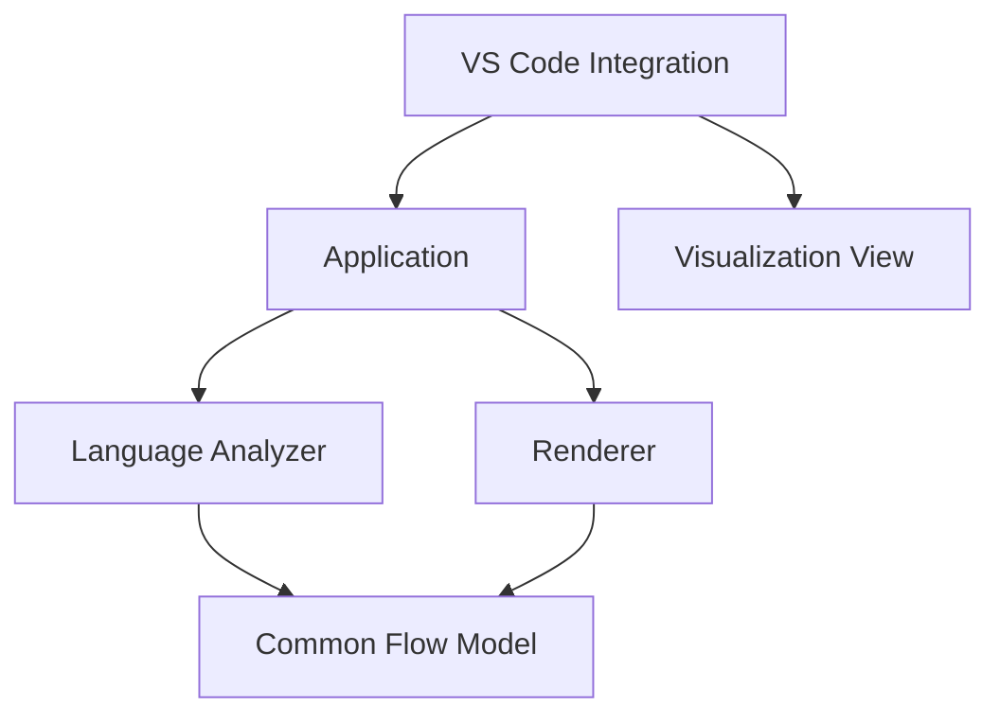
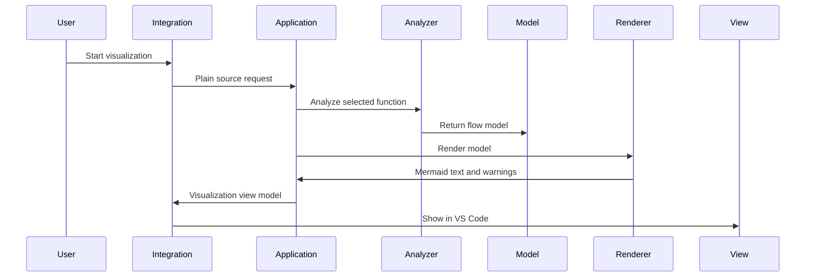
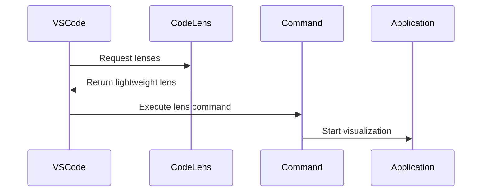
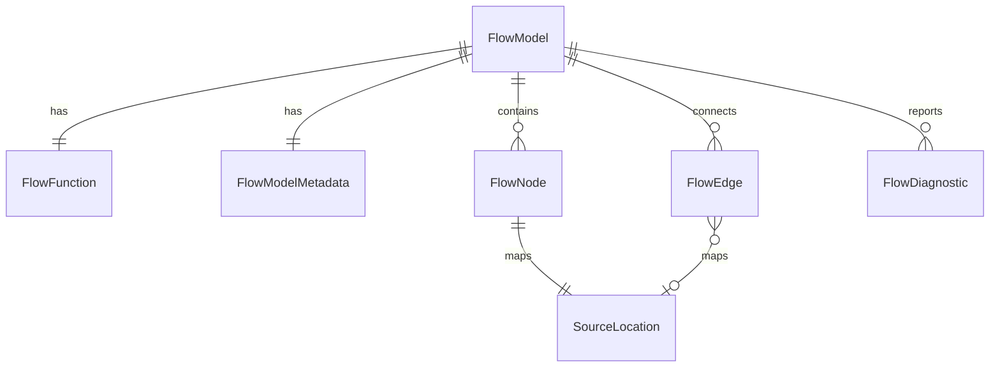

# Design Document

## Overview

Function Flow Visualization は、VS Code 上で現在読んでいる TypeScript / JavaScript 関数を静的解析し、静的処理フローと推定呼び出し順を Mermaid シーケンス図として可視化する機能です。対象ユーザーは VS Code 上で開発するエンジニア、コードレビュアー、レガシーコードの保守開発者です。

この設計は product.md、tech.md、structure.md を最優先の設計指針とし、Requirements を満たす範囲だけを対象にします。Common Flow Model を唯一の中間表現、かつ Analyzer と Renderer を接続する Stable Contract として扱います。

### Goals

- CodeLens またはカーソル位置から対象関数を特定し、静的処理フローを VS Code 上で確認できるようにする。
- Analyzer -> Common Flow Model -> Renderer の一方向依存を維持する。
- VS Code API を Integration 層へ閉じ込め、Analyzer と Renderer を VS Code 非依存にする。
- 完全解析より応答性を優先し、unknown / unresolved と部分結果をユーザーに明示する。

### Non-Goals

- TypeScript / JavaScript 以外の言語対応。
- Sequence Diff、Test Hints、Layer Classification、Architecture Rules の実装。
- PNG / SVG Export、Markdown への直接挿入。
- LLM 連携、実行時トレース、動的呼び出しの完全解決。
- 呼び出し先関数内部の再帰的な深度解析。

## Boundary Commitments

### This Spec Owns

- VS Code command と CodeLens から対象関数を特定する Integration。
- 対象関数を入力にした Application use case。
- TypeScript / JavaScript Analyzer と Language Analyzer Interface。
- Common Flow Model のデータモデル、FlowEdge、metadata、FlowDiagnostic contract。
- Common Flow Model から Mermaid シーケンス図を生成する Renderer。
- 初期表示 UI と Mermaid テキストコピー。
- unknown / unresolved、部分結果、キャンセル、キャッシュ、安全性に関する設計。

### Out of Boundary

- Future capabilities の実装。Sequence Diff、Test Hints、Layer Classification、Architecture Rules は Common Flow Model を入力とする拡張点としてのみ記述する。
- TypeScript / JavaScript 以外の Analyzer 実装。
- PNG / SVG Export、Markdown 直接挿入。
- 外部サービス連携、LLM 連携、実行時トレース。
- Analyzer から Mermaid や表示 UI を直接生成する経路。

### Allowed Dependencies

- VS Code API: Integration 層だけが import できる。
- TypeScript Compiler API: TypeScript Analyzer だけが AST / Symbol 解析のために使用できる。
- Common Flow Model: Application、Analyzer、Renderer、Integration adapter が共有できる唯一の中間 contract。
- Mermaid syntax: Renderer と表示 UI の表示責務に限定して扱う。

### Revalidation Triggers

- Common Flow Model の shape、node kind、diagnostic kind、source location contract が変わる場合。
- Analyzer が VS Code API、Renderer、表示 UI へ依存し始める場合。
- Renderer が AST または Analyzer 固有データを要求し始める場合。
- 表示 UI を Webview adapter 以外へ変更する場合。ただし Application、Analyzer、Renderer の contract を変更しない限り core layer の再設計は不要とする。
- TypeScript / JavaScript 以外の言語を追加する場合。

## Architecture

### Existing Architecture Analysis

現状は VS Code 拡張テンプレートに近く、`src/extension.ts` に hello world command があるだけです。`package.json` は command contribution、`main: ./dist/extension.js`、esbuild bundle、TypeScript strict を定義しています。既存の domain boundary はまだ存在しないため、本設計でレイヤー境界を導入します。

### Architecture Pattern & Boundary Map

選択するパターンは steering と一致する Layered Architecture です。依存方向は Integration から Renderer へ向かう一方向に限定し、下位層から上位層へ戻る import を禁止します。



Key decisions:
- Analyzer は Common Flow Model だけを返す。Mermaid 文字列、Webview HTML、Clipboard 操作は扱わない。
- Renderer は Common Flow Model だけを入力にする。AST、Symbol、Analyzer 固有データは扱わない。
- Integration は VS Code API の adapter であり、Core logic へ `vscode` 型を渡さない。

### Technology Stack

| Layer | Choice / Version | Role in Feature | Notes |
|-------|------------------|-----------------|-------|
| Runtime | VS Code extension host / `engines.vscode ^1.125.0` | Command、CodeLens、表示 UI、Clipboard | Integration 層に限定 |
| Language | TypeScript `6.0.3` / `strict` | 全体実装と型安全 | `any` は使用しない |
| Analyzer | TypeScript Compiler API | TypeScript / JavaScript の AST と Symbol 解析 | Analyzer 層に限定 |
| Renderer | Built-in TypeScript module | Common Flow Model から Mermaid 生成 | 新規依存なし |
| Build | esbuild `0.28.1` | extension bundle | 既存構成を維持 |
| Test | Mocha / VS Code Test | Core unit と VS Code integration test | テスト層を分離 |

## File Structure Plan

### Directory Structure

```text
src/
├── extension.ts
├── integration/
│   ├── commands.ts
│   ├── codeLensProvider.ts
│   ├── documentSelector.ts
│   ├── visualizationView.ts
│   ├── webviewVisualizationAdapter.ts
│   ├── clipboard.ts
│   ├── workspaceTrust.ts
│   └── vscodeAdapters.ts
├── application/
│   ├── visualizeFunctionFlow.ts
│   ├── analyzerRegistry.ts
│   ├── cache.ts
│   └── visualizationViewModel.ts
├── analyzers/
│   ├── languageAnalyzer.ts
│   └── typescript/
│       ├── typescriptAnalyzer.ts
│       ├── functionLocator.ts
│       ├── astFlowExtractor.ts
│       └── symbolResolver.ts
├── flow-model/
│   ├── flowModel.ts
│   ├── flowNode.ts
│   ├── flowEdge.ts
│   ├── metadata.ts
│   ├── diagnostics.ts
│   └── sourceLocation.ts
├── renderer/
│   └── mermaidRenderer.ts
└── test/
    ├── unit/
    │   ├── flowModel.test.ts
    │   ├── flowEdge.test.ts
    │   ├── flowModelMetadata.test.ts
    │   ├── typescriptAnalyzer.test.ts
    │   └── mermaidRenderer.test.ts
    └── integration/
        ├── commandFlow.test.ts
        └── codeLensProvider.test.ts
```

### Modified Files

- `src/extension.ts` — extension entry を thin entry にし、commands、CodeLens、visualization view lifecycle を登録する。
- `package.json` — `glitchlens.visualizeFunctionFlow` command、CodeLens activation、workspace trust capabilities、必要な configuration を定義する。既存 hello world command は置き換え対象。
- `tsconfig.json` — `strict` を維持する。追加 compiler option は設計上必須ではない。
- `src/integration/visualizationView.ts` — WebView の表示状態、ズーム・パン操作、入力イベントの競合回避を管理する。
- `src/integration/webviewMermaid.js` — Mermaid SVG の描画後も表示ラッパーのズーム状態と干渉しないことを保証する。
- `src/test/visualizationView.test.ts` — ボタン、ホイール、ピンチに対応するWebView操作契約と倍率境界を検証する。
- `eslint.config.mjs` — 必要に応じて core 層での `vscode` import 禁止を lint rule または review rule として補強する。

## System Flows

### Command / Cursor Flow



### CodeLens Flow



CodeLens provider は対象関数候補と command 引数だけを返します。詳細解析は command 実行後に Application が開始します。

## Requirements Traceability

| Requirement | Summary | Components | Interfaces | Flows |
|-------------|---------|------------|------------|-------|
| 1.1 | CodeLens から対象関数を特定 | CodeLensProvider, CommandController | CodeLens command args | CodeLens Flow |
| 1.2 | カーソル位置から対象関数を特定 | CommandController, FunctionLocator | VisualizationRequest | Command Flow |
| 1.3 | 対象関数なしを通知 | CommandController, VisualizationView | VisualizationError | Command Flow |
| 1.4 | 非対応言語を通知 | DocumentSelector, CommandController | SupportedLanguage | Command Flow |
| 2.1 | 対象コードを実行しない | TypeScriptAnalyzer | AnalyzerInput | Command Flow |
| 2.2 | 処理順序を保持 | AstFlowExtractor, FlowModel | FlowNode.order | Command Flow |
| 2.3 | Call を抽出 | AstFlowExtractor | FlowCallNode | Command Flow |
| 2.4 | Branch Loop Await Return Throw TryCatch を識別 | AstFlowExtractor | FlowNode union | Command Flow |
| 2.5 | 深度解析しない | TypeScriptAnalyzer | AnalyzerConfig.maxDepth | Command Flow |
| 3.1 | 元コード順序を保持表示 | FlowModel, MermaidRenderer, VisualizationView | FlowNode.order, FlowEdge.executionOrder, SourceLocation | Command Flow |
| 3.2 | 元コード追跡情報を表示 | VisualizationView, FlowModel | SourceLocation, RenderSourceMapEntry | Command Flow |
| 3.3 | 推定呼び出し順を一貫表示 | FlowModel, MermaidRenderer | FlowNode.order, FlowEdge.executionOrder | Command Flow |
| 3.4 | 順序不確定箇所を区別 | FlowDiagnostic, VisualizationView | Diagnostic severity | Command Flow |
| 4.1 | Mermaid テキスト生成 | MermaidRenderer | RenderResult | Command Flow |
| 4.2 | VS Code 上に表示 | VisualizationView | VisualizationResult | Command Flow |
| 4.3 | 静的処理フローを視覚確認 | VisualizationView, MermaidRenderer | VisualizationViewModel | Command Flow |
| 4.4 | 制御ブロックの種類別装飾 | VisualizationView, webviewMermaid.js | SVG decoration contract | Mermaid Render Flow |
| 4.5 | 部分結果を表示 | Application, VisualizationView | PartialAnalysisResult | Command Flow |
| 5.1 | コピー操作提供 | VisualizationView, ClipboardAdapter | CopyCommand | Command Flow |
| 5.2 | Mermaid テキストを保存 | ClipboardAdapter | MermaidText | Command Flow |
| 5.3 | コピー不可理由を通知 | ClipboardAdapter, VisualizationView | VisualizationError | Command Flow |
| 6.1 | unknown unresolved 表示 | TypeScriptAnalyzer, MermaidRenderer | UnknownCallNode | Command Flow |
| 6.2 | 未解決要素を認識可能にする | Application, VisualizationView | VisualizationNotice | Command Flow |
| 6.3 | 解析範囲を表示 | Application, VisualizationView | PartialAnalysisResult | Command Flow |
| 6.4 | 解析済みと未解析を区別 | VisualizationView | VisualizationNotice | Command Flow |
| 6.5 | 動的呼び出し完全解決を保証しない | TypeScriptAnalyzer | Diagnostic kind | Command Flow |
| 7.1 | ソースコードを外部送信しない | All components | Local-only boundary | Command Flow |
| 7.2 | 解析結果を外部送信しない | All components | Local-only boundary | Command Flow |
| 7.3 | LLM 連携しない | Boundary | None | None |
| 7.4 | 実行時トレースしない | TypeScriptAnalyzer | Static-only analyzer | Command Flow |
| 8.1 | 通常規模で即時確認 | Application, Cache | CacheKey with analyzer version, cancellation | Command Flow |
| 8.2 | 解析中状態を表示 | CommandController, VisualizationView | Progress state | Command Flow |
| 8.3 | 編集操作を継続可能 | Application | CancellationToken adapter | Command Flow |
| 8.4 | 応答性優先で部分結果 | Application, TypeScriptAnalyzer | PartialAnalysisResult | Command Flow |
| 8.5 | 失敗理由を提示 | Application, VisualizationView | VisualizationError | Command Flow |
| 9.1-9.3 | 100%の固定基準サイズと大規模図のスクロール | VisualizationView, webviewMermaid.js | DisplayState, intrinsic SVG sizing | Viewer Flow |
| 9.4-9.6 | Fit、手動倍率変更、100%リセット | VisualizationView | DisplayState, Fit calculation | Viewer Flow |
| 9.7-9.9 | 縦横比、倍率範囲、表示操作との非干渉 | VisualizationView, webviewMermaid.js | ZoomBounds, display wrapper contract | Viewer Flow |
| 9.10-9.12 | Pan、入力抑止、fallback | VisualizationView, webviewMermaid.js | PanState, Fallback view | Viewer Flow |
| 9.13-9.14 | 余白と描画失敗時fallback | webviewMermaid.js, VisualizationView | Mermaid sequence configuration | Mermaid Render Flow |
| 9.15-9.18 | ホイール、ピンチ、倍率境界、通常スクロール | VisualizationView | Wheel, Pinch, input arbitration policies | Viewer Flow |
| 9.23 | メッセージ間隔を維持したメッセージラベルの位置調整 | webviewMermaid.js | Message label decoration contract | Mermaid Render Flow |

## Components and Interfaces

| Component | Domain / Layer | Intent | Req Coverage | Key Dependencies | Contracts |
|-----------|----------------|--------|--------------|------------------|-----------|
| ExtensionEntry | VS Code Integration | 拡張の登録入口 | 1.1, 1.2, 5.1 | Commands P0, CodeLens P1 | Service |
| CommandController | VS Code Integration | command 実行と通知 | 1.2, 1.3, 4.2, 8.2 | Application P0 | Service |
| CodeLensProvider | VS Code Integration | 関数上の起動 UI | 1.1 | FunctionLocator P1 | Service |
| VisualizationView | VS Code Integration | 表示方式に依存しない可視化表示境界 | 3.1, 4.2, 4.4, 6.4 | VisualizationViewModel P0 | State |
| ClipboardAdapter | VS Code Integration | Mermaid text copy | 5.1, 5.2, 5.3 | VS Code Clipboard P0 | Service |
| VisualizeFunctionFlowUseCase | Application | 解析から表示用結果までの orchestration | 1.2, 2.1, 4.5, 8.4 | Analyzer P0, Renderer P0, Cache P1 | Service |
| AnalyzerRegistry | Application | language id から Analyzer を選択 | 1.4, 2.1 | LanguageAnalyzer P0 | Service |
| AnalysisCache | Application | document version と analyzer version 単位の再利用 | 8.1, 8.3 | CacheKey P1 | State |
| LanguageAnalyzer | Analyzer | 全 Analyzer の共通契約 | 2.1, 2.4, 6.3 | FlowModel P0 | Service |
| TypeScriptAnalyzer | Analyzer | TS JS 静的解析 | 2.1, 2.3, 2.4, 6.1 | TypeScript Compiler API P0 | Service |
| FunctionLocator | Analyzer | cursor と CodeLens から対象関数を解決 | 1.1, 1.2 | TypeScript SourceFile P0 | Service |
| FlowModel | Common Model | 唯一の中間表現 | 2.2, 3.1, 3.3 | None P0 | State |
| FlowEdge | Common Model | 制御構造と実行順序の接続表現 | 2.4, 3.1, 3.4 | FlowNode P0 | State |
| FlowModelMetadata | Common Model | 解析結果の由来と cache invalidation 情報 | 7.2, 8.1 | Analyzer P0 | State |
| MermaidRenderer | Renderer | Mermaid sequence diagram 生成 | 4.1, 6.1 | FlowModel P0 | Service |

### VS Code Integration

#### ExtensionEntry

| Field | Detail |
|-------|--------|
| Intent | extension activation 時に Integration component を登録する |
| Requirements | 1.1, 1.2, 5.1 |

**Responsibilities & Constraints**
- `activate` は command、CodeLens、display/clipboard adapters の登録だけを行う。
- VS Code API import は Integration 配下と `extension.ts` に限定する。
- `context.subscriptions` へ Disposable を集約する。

**Contracts**: Service [x] / State [ ] / API [ ] / Event [ ]

#### CommandController

| Field | Detail |
|-------|--------|
| Intent | user action を plain request に変換し Application を呼ぶ |
| Requirements | 1.2, 1.3, 1.4, 4.2, 8.2, 8.5 |

**Responsibilities & Constraints**
- `TextDocument`、`Position`、`CancellationToken` を Integration 内で plain data へ変換する。
- 対象関数なし、非対応言語、解析失敗をユーザー通知へ変換する。
- 解析中 state を表示 UI に通知する。
- Application が返す `VisualizationViewModel` を VisualizationView へ渡す。CommandController は Mermaid 生成や FlowModel 変換を行わない。

##### Service Interface

```typescript
interface CommandController {
  visualizeFromCursor(command: CursorCommandInput): Promise<void>;
  visualizeFromCodeLens(command: CodeLensCommandInput): Promise<void>;
}
```

#### CodeLensProvider

| Field | Detail |
|-------|--------|
| Intent | 対応言語の関数付近に軽量な起動 affordance を提供する |
| Requirements | 1.1, 8.3 |

**Responsibilities & Constraints**
- 関数候補と range の検出に留め、詳細解析は行わない。
- cancellation request を尊重し、古い CodeLens 計算を破棄する。

#### VisualizationView

| Field | Detail |
|-------|--------|
| Intent | VS Code 上で Mermaid 図、未解決要素、解析不能箇所を表示する |
| Requirements | 3.1, 3.2, 4.2, 4.3, 6.2, 6.4 |

**Responsibilities & Constraints**
- 表示方式に依存しない Integration 境界として、Application から受け取った `VisualizationViewModel` を VS Code 上へ表示する。
- 初期実装では Webview adapter を利用する。
- 将来 Sidebar、Panel、Custom Editor へ変更しても、Application、Analyzer、Renderer を変更しない。
- Webview adapter では CSP、nonce、`localResourceRoots` 最小化を適用する。
- 表示 UI は Analyzer 固有データ、Renderer の戻り値、FlowDiagnostic、RendererWarning を直接受け取らず、Application が生成した `VisualizationViewModel` とユーザー向け `VisualizationNotice` だけを扱う。
- Mermaid sequence diagram の描画は Webview 内でローカル bundle された Mermaid 公式 Renderer を使用し、外部 CDN や外部ネットワークを使用しない。
- Mermaid 初期化時の theme variables は VS Code theme から解決済みの実色だけを渡し、`currentColor` や未解決の CSS variable は渡さない。実色として解決できない場合は Dark Theme に馴染む安全な fallback 色を使用する。
- Mermaid 描画に失敗した場合は、Application や Renderer の契約を変更せず、表示層で Mermaid text を fallback 表示する。
- Mermaid text、Common Flow Model、Renderer contract は表示改善のために変更しない。制御構造の配色と装飾は Visualization / Webview 層の責務とする。
- `loop`、`alt`、`opt`、`critical`、`option` は Webview が描画済み SVG を装飾し、種類ごとに異なるアクセントカラーを枠線、ラベル、必要な文字色へ適用する。
- Control Block の枠線は Mermaid 既定の `.loopLine` 等のスタイル競合を避けるため、描画後の対象 SVG shape と label text へ `style.setProperty` で実色を直接適用する。枠線は `stroke-dasharray: none`、`stroke-width: 1.8px` とし、`loop` `#9fd0ff`、`alt` `#8ff2ff`、`opt` `#fde68a`、`critical` `#ddd6fe`、`option` `#fbcfe8` を使用する。制御ラベルは `font-size: 14px` とする。制御ラベル枠の横幅を追加調整する専用定義値は設けず、Mermaid の自然な幅計算を維持する。
- ライフラインと participant 境界線は Webview CSS で背景へ埋もれない明るいグレー系へ調整し、root function の participant は他 participant より少し強い枠線と背景で強調する。
- 実行中の区間は Webview が描画用 Mermaid text に `activate` / `deactivate` を補助的に加えて Mermaid の activation 表示を利用する。この補助は Webview 内の描画入力だけに限定し、コピー対象の Mermaid text、Common Flow Model、Renderer contract は変更しない。
- `await` 呼び出しと `return` は Webview が描画済み SVG を装飾し、await は通常 call と区別できるアクセントカラー、return は控えめな色で call と区別する。
- Renderer は引き続き Mermaid text の生成のみを担当し、ライフライン、activation、await / return、root participant の配色やテーマ適用は Visualization / Webview 層の責務とする。
- root participant は対象関数の開始から終了まで常時 activation 表示し、解析対象と処理全体の起点を明示する。他 participant は Call / Await の実行期間だけ activation 表示する。
- ライフラインはダークテーマ上で埋もれない白系にし、activation、文字、矢印より目立ちすぎない太さと opacity に調整する。
- Control Block は `loop` Blue、`alt` Cyan、`opt` Yellow、`critical` Purple、`option` Magenta のアクセントを枠線、ラベル、タブへ適用し、淡いグレー基調へ寄せない。
- 長い participant 名、条件式、Call / Await ラベルが途中で切れないよう、Webview 側で Mermaid sequence の participant 間隔、message 間隔、box padding、SVG overflow、text layout を調整する。
- Mermaid のレイアウト計算結果を尊重し、SVG 生成後に `textLength`、`lengthAdjust`、SVG text の `font-size` を破壊的に変更しない。
- 100%表示では `useMaxWidth: false` を使用し、Mermaidが計算したSVGの自然サイズを維持する。WebView幅を超える図は表示ラッパー内でスクロールし、自動縮小しない。文字切れ対策はSVG後処理ではなく、Mermaid sequence設定の余白や幅計算を優先して調整する。
- participant 名は上下の actor box 内で水平方向・垂直方向に中央揃えし、十分な上下左右の余白を確保する。SVG 生成後は対応する actor の `text` 要素へ `text-anchor: middle`、`dominant-baseline: middle`、`alignment-baseline: middle` を付与する。
- Mermaid が生成した `x`、`y`、`textLength`、`lengthAdjust` は維持し、participant 名のはみ出し防止は Mermaid のレイアウト計算を優先する。SVG 生成後にこれらの text 属性を破壊的に変更しない。
- メッセージラベルと線の距離は Webview の描画後処理で調整する。メッセージラベルの `text` 要素だけを識別し、専用の `translateY` 値（初期値は `20px`）を `transform` に追加して下げる。Mermaid が生成した `x`、`y`、`textLength`、`lengthAdjust`、font-size は変更しない。
- メッセージラベルの位置調整は SVG のラベル要素だけに適用し、メッセージ線、矢印、activation、participant、control block には適用しない。`messageMargin: 70` は維持し、メッセージ間の縦方向の間隔を変更しない。
- `SourceMap` は内部データとして `VisualizationViewModel` に保持するが、Marketplace 公開版の Webview では画面下部の Source locations 一覧を表示しない。
- Copy Mermaid は表示中の Mermaid text をコピーする既存操作として維持し、SVG 装飾や Source locations 非表示の影響を受けない。

#### ClipboardAdapter

| Field | Detail |
|-------|--------|
| Intent | 現在表示中の Mermaid テキストを VS Code Clipboard へ保存する |
| Requirements | 5.1, 5.2, 5.3 |

**Responsibilities & Constraints**
- Clipboard API の利用を Integration 層に閉じ込める。
- コピー対象がない場合はユーザー通知へ変換する。

### Application

#### VisualizeFunctionFlowUseCase

| Field | Detail |
|-------|--------|
| Intent | 対象関数特定済み request を Analyzer と Renderer へ渡して表示可能な結果へまとめる |
| Requirements | 2.1, 4.5, 6.3, 8.1, 8.4 |

**Responsibilities & Constraints**
- Analyzer 選択、解析開始、Renderer 呼び出し、部分結果処理を調停する。
- Mermaid syntax、AST、VS Code API を直接扱わない。
- 完全解析失敗時も部分結果がある場合は `VisualizationResult` を返す。
- FlowDiagnostic と RendererWarning をユーザー向け `VisualizationNotice` へ変換し、VisualizationView へ渡せる形にする。
- Application は具体的な表示方式を知らない。

##### Service Interface

```typescript
interface VisualizeFunctionFlowUseCase {
  execute(input: VisualizationRequest): Promise<VisualizationResult>;
}
```

#### AnalyzerRegistry

| Field | Detail |
|-------|--------|
| Intent | language id から利用可能な Analyzer を選択する |
| Requirements | 1.4, 2.1 |

**Responsibilities & Constraints**
- 初期登録は TypeScript / JavaScript Analyzer のみ。
- 未対応言語は user-visible error へ変換可能な error envelope を返す。

#### AnalysisCache

| Field | Detail |
|-------|--------|
| Intent | document URI、version、function range、configuration、analyzer id、analyzer version 単位で結果を再利用する |
| Requirements | 8.1, 8.3, 8.4 |

**Responsibilities & Constraints**
- document change で該当 document の cache を無効化する。
- cache key には document URI、document version、function range、configuration digest、analyzer id、analyzer version を必ず含める。
- Analyzer の解析ロジックまたは Common Flow Model 変換仕様が変わる場合は analyzer version を変更し、古い結果を再利用しない。
- 部分結果も cache 可能だが、source version が一致する場合だけ使用する。
- cache は外部永続化しない。

### Analyzer

#### LanguageAnalyzer Interface

| Field | Detail |
|-------|--------|
| Intent | すべての Analyzer が従う共通契約 |
| Requirements | 2.1, 2.4, 6.3 |

##### Service Interface

```typescript
interface LanguageAnalyzer {
  readonly languageIds: readonly SupportedLanguageId[];
  analyze(input: AnalyzerInput): Promise<AnalyzerResult>;
}

interface AnalyzerInput {
  source: SourceFileInput;
  cursorOffset: number;
  configuration: AnalyzerConfiguration;
  cancellation: CancellationSignal;
}

interface AnalyzerResult {
  model: FlowModel;
  diagnostics: readonly FlowDiagnostic[];
  completeness: AnalysisCompleteness;
}
```

**Invariants**
- Analyzer は VS Code API、Renderer、VisualizationView、他言語 Analyzer に依存しない。
- Analyzer は Mermaid テキストを生成しない。
- Analyzer は対象コードを実行しない。

#### TypeScriptAnalyzer

| Field | Detail |
|-------|--------|
| Intent | TypeScript / JavaScript の AST と Symbol 情報から FlowModel を生成する |
| Requirements | 2.1, 2.2, 2.3, 2.4, 2.5, 6.1, 6.5 |

**Responsibilities & Constraints**
- TypeScript Compiler API で SourceFile を作成し、cursor offset から対象関数を特定する。
- 対象関数 body の statement order を保持して FlowNode と FlowEdge を生成する。
- call expression、branch、loop、await、return、throw、try/catch を抽出する。
- branch、loop、try/catch の接続関係は FlowEdge として生成する。
- 呼び出し先内部へ深度解析しない。
- 静的に解決できない call は `unknown` または `unresolved` diagnostic 付きの node とする。
- `analyzerId` と `analyzerVersion` を FlowModel metadata に設定する。

### Common Flow Model

#### FlowModel

| Field | Detail |
|-------|--------|
| Intent | Analyzer と Renderer を接続する唯一の Stable Contract。FlowNode、FlowEdge、metadata を含む |
| Requirements | 2.2, 3.1, 3.3, 3.4, 6.1, 6.2 |

##### State Contract

```typescript
type FlowNode =
  | FlowCallNode
  | FlowBranchNode
  | FlowLoopNode
  | FlowAwaitNode
  | FlowReturnNode
  | FlowThrowNode
  | FlowTryCatchNode;

type FlowEdgeKind =
  | 'next'
  | 'true'
  | 'false'
  | 'loop-body'
  | 'loop-exit'
  | 'try'
  | 'catch'
  | 'finally'
  | 'return'
  | 'throw'
  | 'uncertain';

interface FlowEdge {
  id: FlowEdgeId;
  sourceNodeId: FlowNodeId;
  targetNodeId: FlowNodeId;
  kind: FlowEdgeKind;
  executionOrder: number;
  label?: string;
  condition?: string;
  sourceLocation?: SourceLocation;
}

interface FlowModel {
  metadata: FlowModelMetadata;
  rootFunction: FlowFunction;
  nodes: readonly FlowNode[];
  edges: readonly FlowEdge[];
  diagnostics: readonly FlowDiagnostic[];
  source: FlowSource;
  completeness: AnalysisCompleteness;
}

interface FlowModelMetadata {
  schemaVersion: string;
  analyzerId: string;
  analyzerVersion: string;
  languageId: SupportedLanguageId;
  generatedAt: string;
  sourceDocumentVersion: number;
  completeness: AnalysisCompleteness;
  configurationDigest: string;
  rootFunctionIdentifier?: string;
}
```

**Required Fields**
- FlowNode `id`: stable within one analysis result.
- FlowNode `kind`: discriminated union key.
- FlowNode `order`: monotonic order preserving source traversal.
- FlowNode `sourceLocation`: file URI string, range, and optional symbol display name.
- FlowNode `resolution`: `resolved`, `unknown`, or `unresolved` for call-like nodes.
- FlowEdge `sourceNodeId` and `targetNodeId`: node connection endpoints.
- FlowEdge `kind`: `next`、`true`、`false`、`loop-body`、`loop-exit`、`try`、`catch`、`finally`、`return`、`throw`、`uncertain` のいずれか。
- FlowEdge `executionOrder`: edge traversal order.
- FlowEdge optional fields: label、condition、sourceLocation。
- Metadata: analyzer id、analyzer version、language id、generated at、source document version、completeness、configuration digest、schema version。

**Invariants**
- AST node、TypeScript symbol、VS Code object は FlowModel に含めない。
- TypeScript AST や Symbol 情報を FlowEdge に直接保持しない。
- Branch、Loop、Try/Catch の接続関係は FlowEdge で表現する。
- FlowNode と FlowEdge の両方を Common Flow Model の Stable Contract とする。
- Metadata は言語固有 AST や VS Code object を保持しない。
- Renderer と future extension points は FlowModel だけを入力にする。
- Model shape changes are revalidation triggers.

### Renderer

#### MermaidRenderer

| Field | Detail |
|-------|--------|
| Intent | FlowModel の nodes と edges から Mermaid sequence diagram text と source map を生成する |
| Requirements | 3.1, 3.3, 4.1, 4.3, 5.2, 6.1 |

##### Service Interface

```typescript
interface MermaidRenderer {
  render(model: FlowModel): RenderResult;
}

interface RenderResult {
  mermaidText: string;
  warnings: readonly RendererWarning[];
  sourceMap: readonly RenderSourceMapEntry[];
}
```

**Responsibilities & Constraints**
- FlowNode と FlowEdge の `order` / `executionOrder` に従って Mermaid sequence diagram を生成する。
- Mermaid 内要素と Source Location を対応付ける source map を生成する。
- unknown / unresolved は明示的な participant または note として表示可能な形にする。
- Renderer は AST、Analyzer 固有データ、VS Code API を扱わない。
- Renderer は Webview、表示文言の詳細、UI 固有 diagnostic 型を扱わない。
- 表現できない model 要素がある場合は UI 非依存な `RendererWarning` として返す。
- 現時点では `MermaidRenderer` を明示的な実装対象とし、PlantUML など将来形式は実装しない。
- Renderer interface は Common Flow Model を入力にする独立 contract として維持するが、過剰な generic abstraction は導入しない。
- PNG / SVG Export は実装しない。

## Data Models

### Domain Model



### Logical Data Model

- `SourceFileInput`: `uri`, `languageId`, `version`, `text` を持つ plain input。
- `VisualizationRequest`: source、cursor offset、configuration、cancellation を持つ Application input。
- `FlowModel`: metadata、root function、ordered nodes、edges、diagnostics、source metadata、completeness を持つ stable contract。
- `FlowEdge`: source node id、target node id、edge kind、execution order、optional label、optional condition、optional source location を持つ制御接続。
- `FlowModelMetadata`: analyzer id、analyzer version、language id、generated at、source document version、completeness、configuration digest、schema version、optional root function identifier を持つ。
- `RenderResult`: Mermaid text、renderer warnings、source map を持つ Renderer result。
- `VisualizationResult`: render result、partial flag、FlowDiagnostic と RendererWarning から変換された user-visible notices を持つ Application output。

### Data Contracts & Integration

- Source text は process memory 内だけで扱い、外部送信も永続化もしない。
- Cache key は document URI、document version、function range、configuration digest、analyzer id、analyzer version で構成する。
- Source location は表示 UI の追跡情報に使うが、AST object を露出しない。
- Analyzer の解析ロジックまたは Common Flow Model 変換仕様が変わった場合は analyzer version を更新し、古い cache entry を再利用しない。
- Metadata は Sequence Diff、Test Hints、キャッシュ、トラブルシュートで利用できる安定情報とする。ただしこの spec では Sequence Diff と Test Hints は実装しない。

## Error Handling

### Error Strategy

- Analyzer は recoverable な問題を `FlowDiagnostic` と部分結果で返す。
- Application は fatal error、unsupported language、target not found、cancelled、partial success を区別する。
- Application は FlowDiagnostic と RendererWarning をユーザー向け表示情報へ変換する。
- Integration は Application error envelope と user-visible notices をユーザー通知、VisualizationView、または no-op に変換する。

### Error Categories and Responses

- **TargetNotFound**: 対象関数が見つからない。通知して解析を開始しない。
- **UnsupportedLanguage**: TypeScript / JavaScript 以外。通知して解析を開始しない。
- **UnresolvedCall**: unknown / unresolved node として FlowModel に保持し、表示に反映する。
- **PartialAnalysis**: 解析できた範囲を表示し、未解析箇所を明示する。
- **Cancelled**: 古い解析結果を破棄し、必要なら新しい解析を開始する。
- **RenderFailure**: Mermaid text を生成できない場合はユーザーに理由を通知し、コピー操作を無効化する。

### Monitoring

初期設計では外部 telemetry を導入しない。必要なログは VS Code extension host の開発者向け console に限定し、ソースコード本文や解析結果本文を出力しない。

## Caching Strategy

- Cache は Application 層に置く。
- Cache entry は `AnalysisCacheEntry` として FlowModel、RenderResult、diagnostics summary、renderer warning summary を保持する。
- `TextDocument.version` が変わった場合、その document の cache を無効化する。
- Configuration が変わった場合、configuration digest が異なるため cache hit しない。
- Analyzer id または analyzer version が変わった場合、cache key が異なるため古い解析結果を再利用しない。
- Cancelled result は cache しない。
- Partial result は source version と function range が一致する場合だけ cache できる。
- Analyzer version は cache invalidation のための内部識別子であり、ユーザー表示文言には使わない。

## Performance & Scalability

- CodeLens provider は関数候補検出だけを行い、詳細解析をしない。
- 解析は cancellation-aware にし、document change や新しい command 実行で古い解析を破棄できる。
- 通常規模の関数では即時確認できる応答性を目標にし、具体的な数値目標は実装計測後に調整する。
- 大きな関数では完全解析より部分結果を優先する。
- 呼び出し先内部の深度解析を行わないことで解析範囲を対象関数内に制限する。
- Renderer は FlowModel の nodes と edges を単一 traversal で処理し、edge execution order を Mermaid 出力順へ反映する。

## Security Considerations

- 対象コードは実行しない。
- ソースコード、FlowModel、Mermaid text、diagnostics は外部サービスへ送信しない。
- LLM 連携は実装しない。
- Webview adapter は CSP、nonce、`localResourceRoots` 制限を設定する。
- Workspace Trust は package manifest と runtime guard の両方で考慮する。Restricted Mode では安全に動作できる静的表示だけを許可するか、機能を明示的に制限する。
- Clipboard はユーザー操作でのみ実行する。

## Display Interaction Design: Zoom, Pan, and Sequence Spacing

表示倍率、Fit、スクロール、ドラッグ移動、余白調整は Visualization / Webview 層の責務とする。MermaidRenderer、Common Flow Model、Mermaidコピー対象テキスト、SourceMap contract は変更しない。

### Display State

WebViewは、固定サイズの外側viewportと、描画済みSVGを含む内側canvasを分離する。viewportは`overflow:auto`でスクロール、表示領域の幅・高さ、入力イベントの受け皿を担当し、ズーム用transformを適用しない。canvasだけが`scale`、`translateX`、`translateY`を管理する。

表示状態はUI倍率と内部描画倍率を分離する。`uiScale=1`をUI上の100%とし、初期表示では調整可能な固定値`INITIAL_RENDER_SCALE`（例: 0.9）をcanvasへ乗算する。ユーザー操作の倍率は`uiScale`を変更し、実効canvas倍率は`INITIAL_RENDER_SCALE * uiScale`として算出する。図の自然サイズや関数規模から初期倍率を再計算しない。

100%ではMermaidの`useMaxWidth`を無効にし、SVGの自然サイズと内部の文字・枠・線の基準サイズを維持する。最小倍率・最大倍率・ズームステップ・初期描画係数はWebView側の定数として一元管理する。

Fitは初期倍率とは別の明示的な操作として扱う。固定viewportの寸法とSVG自然サイズから、図全体が収まる`uiScale`を計算してcanvasへ適用する。viewportの寸法やスクロール領域はFit前後で変更しない。Fit後の拡大・縮小は、その時点の`uiScale`を基準に行う。100%リセットは`uiScale=1`、初期描画係数、canvas translate、viewportスクロール位置を初期状態へ戻す。

SVG内部の `x`、`y`、`textLength`、`lengthAdjust`、font-size は変更せず、表示ラッパーへのtransformで倍率と移動を適用する。これにより、Mermaidのレイアウト、既存のSVG装飾、SourceMap、コピー処理を分離して維持する。

### User Interaction

- 拡大・縮小はWebViewのボタン、マウスホイール、トラックパッド／タッチデバイスのピンチ操作に対応する。
- マウスホイールは入力方向と量を表示倍率へ反映し、ピンチは接触点間の拡大縮小を連続的な倍率変更として反映する。いずれも同じ表示状態更新契約を通る。
- 拡大・縮小には最小倍率・最大倍率を設ける。
- Fit操作で内側canvasだけを図全体がviewportへ収まる倍率へ変更する。図の文字・枠サイズを固定するUI上100%とは別の状態である。
- 100%リセット操作でUI倍率、初期描画係数、初期パン位置、スクロール位置を初期状態へ戻す。
- 拡大状態ではポインターによるドラッグで図を移動できる。
- ドラッグ中は `user-select: none` 等でテキスト選択を抑止し、図の表示領域外への意図しないページスクロールを抑止する。
- 拡大縮小とパンの現在状態を必要に応じてUIで認識できるようにする。
- Mermaid描画失敗時のfallback表示では、既存のテキスト表示を優先する。

### Pan State and Pointer Events

Viewerの表示状態は、WebView表示層で次の値を一元管理する。

- `currentUiScale`: UI上の現在倍率。1が100%を表す。
- `initialRenderScale`: UI倍率100%時にcanvasへ適用する固定初期係数。
- `currentEffectiveScale`: canvasへ実際に適用する倍率。`initialRenderScale * currentUiScale`で算出する。
- `currentTranslateX`: ViewerのX方向移動量（px）
- `currentTranslateY`: ViewerのY方向移動量（px）
- `currentScrollLeft`: スクロールコンテナの水平方向スクロール位置
- `currentScrollTop`: スクロールコンテナの垂直方向スクロール位置

- viewportの幅・高さは倍率変更、Fit、Panで変更しない。
- transformはcanvasだけに適用し、viewportには適用しない。
- Mermaid text、SourceMap、SVG装飾、Copy Mermaid、コードジャンプはcanvasの表示状態から独立する。

ZoomとPanは同じViewer wrapperのCSS transformへ反映し、順序は `translate(x, y) scale(scale)` に統一する。SVG内部の座標、属性、レイアウトは変更せず、Mermaidの再描画も行わない。Fitと100%リセットはtranslateを初期位置へ戻し、100%リセットではスクロール位置も初期位置へ戻す。その後もZoom、Pan、スクロールを継続利用できるようにする。

Pan入力にはPointer Eventsを使用する。Viewer上のprimary pointerの`pointerdown`で開始し、`setPointerCapture`でポインターがWebView外へ出ても同じViewerが`pointermove`を受け取れるようにする。`pointerup`、`pointercancel`、`lostpointercapture`では必ず`releasePointerCapture`を試行し、ドラッグ状態と`user-select`抑止を解除する。

UIボタン、Copy Mermaid、リンク、フォーム要素をPan開始対象から除外する。ドラッグ中だけ`preventDefault`を適用し、通常クリック、Mermaid内リンク、WebViewの通常スクロールとの競合を抑える。Viewerの入力許可方針はピンチを認識でき、かつ通常の縦スクロールを共存させる設定とする。ホイールはズーム対象上の入力だけを倍率変更へ振り向け、通常の縦スクロールを妨げない。ピンチ中は2本のポインターをジェスチャーとして扱い、1本のポインターによるドラッグパンと区別する。

translate値は有限値であることを確認し、NaN、Infinity、異常に大きい値をCSSへ適用しない。実装上のtranslate上限を設け、scaleとtranslateの更新は必ず同一の状態更新関数を経由する。

ホイールおよびピンチによる倍率変更では、入力イベントの異常値を無視または正規化し、倍率を最小・最大範囲へクランプする。ピンチ終了時には残ったポインター状態を破棄し、以後の単一ポインターによるパンを再開できる状態へ戻す。ズーム中心の厳密な座標補正は現要件の必須条件とせず、既存の`translate` / `scale`契約を維持する範囲で実装する。

### Mermaid Layout Configuration

縦方向の詰まりを改善するため、`messageMargin`、`diagramMarginY`、`boxMargin`、`noteMargin` など既存のsequence設定を見直す。採用値は実装時に通常規模・大規模・長いラベルのfixtureで比較し、横方向の可読性と図の過度な巨大化を両立する値として固定する。100%では`useMaxWidth: false`を使用し、Mermaidレイアウトの自然サイズ、固定viewport、canvas表示transformの責務を分離する。Fitだけがcanvasの表示倍率を変更する。

Task 11.3では、縦方向の可読性を優先して次の値を採用する。`messageMargin: 70`、`noteMargin: 20`、`diagramMarginY: 10`、`boxMargin: 22`、`boxTextMargin: 12`。横方向に影響する`actorMargin: 40`、`diagramMarginX: 8`は変更しない。`useMaxWidth`は100%表示の固定基準サイズを守るため`false`とする。Requirement 9.23 のラベル位置調整はこの間隔設定と独立した SVG text の表示変換として扱う。

採用値は通常規模、多数のCall / Await、nested loop / branch、try / catch / finally、長いparticipant名・条件式を含むMermaid fixtureで比較する。比較ではCall / Await、Note、Control Structure内部・境界の余白、全体の縦サイズ、横方向の可読性、過度な巨大化、participant名の収まりを確認する。余白はMermaid初期化設定で調整し、メッセージラベルの線との距離だけは例外として SVG text への表示用 `transform` で調整する。SVG生成後のDOM操作で`x`、`y`、`textLength`、`lengthAdjust`、font-size等のレイアウト値は変更しない。

### Security and Compatibility

操作用スクリプトは既存のCSP nonce付きWebViewスクリプトに含め、外部CDN・外部ネットワークを使用しない。既存のCopy Mermaid、SourceMap、participant/control block/activation装飾、fallback、Workspace Trustの制約を維持する。

### Traceability

| Requirement | Components | Verification |
|-------------|------------|--------------|
| 9.1-9.5 | VisualizationView, Webview display controller, webviewMermaid.js | UI 100%、初期描画係数、固定基準サイズ、viewportスクロールを確認 |
| 9.6-9.11 | Webview display controller | 固定viewport、canvasのみのズーム、Fit、現在倍率基準、リセット、非干渉を確認 |
| 9.12-9.15 | Webview display controller | 縦横比、倍率境界、初期状態を確認 |
| 9.16-9.19 | Webview display controller, webviewMermaid.js | Pan、入力抑止、余白、fallbackを確認 |
| 9.20-9.22 | Webview display controller | ホイール、ピンチ、倍率クランプ、通常スクロール復帰を確認 |
| 9.23 | webviewMermaid.js | メッセージ間隔を維持し、ラベルだけが線へ近づくことを確認 |

## Testing Strategy

### Visualization Control Toolbar

`VisualizationView.renderHtml` は関数名、コントロールツールバー、図、Mermaid fallback、notice の順に構成する。`model.state` は表示用HTMLへ出力せず、ViewModel とアプリケーション層の状態判定は変更しない。notice は既存どおり `model.notices` から生成し、内部状態名と混在させない。

ツールバーは1行の flex container とし、`Copy Mermaid`、`100%`、`Fit`、`-`、`zoom-level`、`+` の順に左寄せで配置する。`Copy Mermaid` を右端へ寄せる自動マージンは使用しない。現在倍率は `span` 等の非操作要素として維持する。

ズームボタンは `--vscode-button-secondaryBackground`、`--vscode-button-secondaryForeground`、hover/focus 用のVS Codeテーマ変数を優先して使用する。Copy Mermaid は `--vscode-button-secondaryBackground` を基礎に、`--vscode-textLink-foreground` を境界色として使い、テーマに近い濃い青系フォールバックを用意する。目立ちすぎるプライマリ青は使用しない。focus-visible の輪郭と disabled 状態を明示し、CSSはVisualization/WebView層に閉じ込める。Mermaid text、Common Flow Model、Renderer、SourceMap、Copy通信は変更しない。

### Unit Tests

- `FunctionLocator` verifies 1.1, 1.2, 1.3: cursor offset と function range から対象関数を解決できること、失敗時に target not found を返すこと。
- `TypeScriptAnalyzer` verifies 2.1, 2.2, 2.3, 2.4, 2.5: 対象コードを実行せず、Call / Branch / Loop / Await / Return / Throw / TryCatch を source order で抽出し、Branch / Loop / TryCatch の接続を FlowEdge で表現し、深度解析しないこと。
- `FlowModel` verifies 3.1, 3.3, 3.4: node order、edge execution order、metadata、source location、unknown / unresolved の表現が保持されること。
- `FlowEdge` verifies 2.4, 3.1, 3.4: edge kind、source/target node id、condition、optional source location が AST や Symbol を持たずに表現されること。
- `FlowModelMetadata` verifies 7.2, 8.1: analyzer id/version、source document version、configuration digest、schema version が保持されること。
- `MermaidRenderer` verifies 4.1, 4.3, 5.2, 6.1: Mermaid text が FlowModel の nodes と edges だけから生成され、source map と RendererWarning が UI 非依存に返ること。
- `AnalysisCache` verifies 8.1, 8.4: document version、configuration digest、analyzer id、analyzer version に基づく hit/miss、partial result の扱い。
- `VisualizationView` の表示契約テスト verifies 9.1-9.23: 異なる自然サイズのSVGをUI上100%で同じ基準サイズに保つこと、初期描画係数、固定viewport、canvasのみのズーム、スクロール、Fit計算、現在倍率基準の倍率更新、100%リセット時のスクロール・パン初期化、倍率境界、パンとの入力競合、通常縦スクロール、表示ラッパーによる非干渉、メッセージ間隔を維持したラベル位置調整を検証する。

### Integration Tests

- Command from cursor verifies 1.2, 4.2, 8.2: VS Code command から可視化が開始され、解析中状態と表示結果が得られること。
- CodeLens command verifies 1.1, 8.3: CodeLens が軽量に提供され、実行時に解析が開始されること。
- Clipboard flow verifies 5.1, 5.2, 5.3: 表示済み Mermaid text を copy でき、対象なしでは理由が通知されること。
- Unsupported language verifies 1.4: 非対応 language id で通知されること。
- Partial result flow verifies 4.5, 6.3, 6.4, 8.4: unresolved を含む関数でも部分結果が表示されること。
- VisualizationView adapter flow verifies 4.2, 6.2, 6.4: FlowDiagnostic と RendererWarning が Application で user-visible notices に変換され、表示方式を変えても core result を再利用できること。
- VisualizationView interaction flow verifies 9.2, 9.3, 9.4, 9.5, 9.6, 9.7, 9.8, 9.9, 9.10, 9.11, 9.12, 9.13, 9.14, 9.15, 9.16, 9.17, 9.18, 9.19, 9.20, 9.21, 9.22, 9.23: WebView上でUI上100%の自然サイズ表示、初期描画係数、固定viewport、canvasのみのズーム、スクロール、Fit、現在倍率基準の手動ズーム、100%リセット、マウスホイールとピンチを扱い、ドラッグパン・UI操作・通常縦スクロールと競合せず、メッセージ間隔を変えずにラベルだけを線へ近づけることを確認する。

### E2E / UI Tests

- TypeScript function with branch, await, return verifies 2.4, 3.2, 4.3: VS Code 上の可視化結果で静的処理フローを追跡できること。
- JavaScript function with unresolved call verifies 6.1, 6.2: unknown / unresolved がユーザーに見えること。
- Long function cancellation verifies 8.3, 8.5: 編集継続と古い解析破棄ができること。
- Cache invalidation verifies 8.1: analyzer version が変わったときに古い cache entry を再利用しないこと。

### Performance Tests

- 通常規模の関数で CodeLens 生成が詳細解析を行わないことを測定する。
- 通常規模の関数で command から表示までの体感応答性を測定する。
- 大きな関数で partial result が返ること、UI 操作が継続できることを検証する。

## Supporting References

- 詳細な調査ログと公式ドキュメント参照は `research.md` に記録する。
