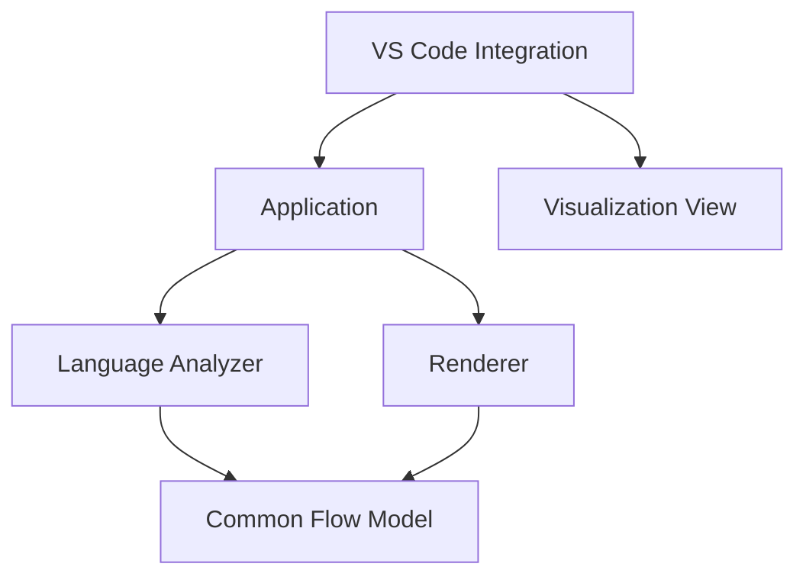
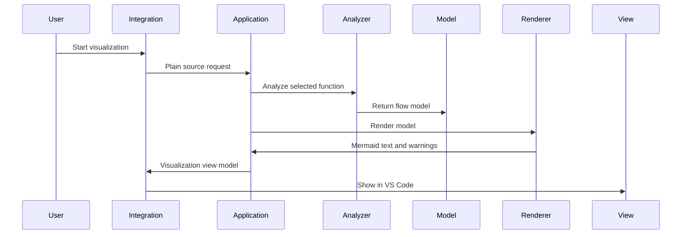
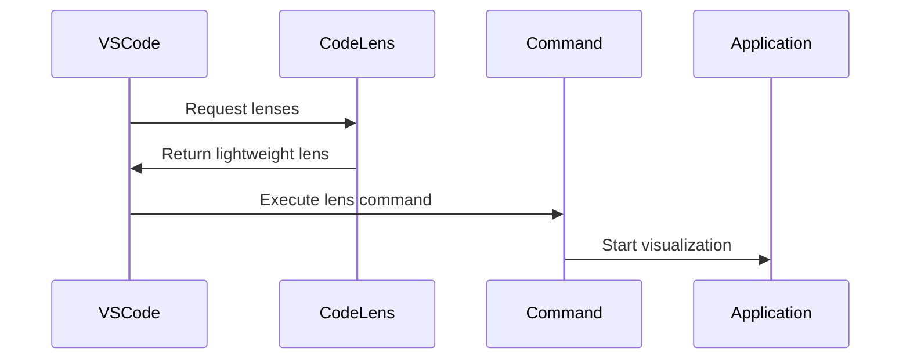
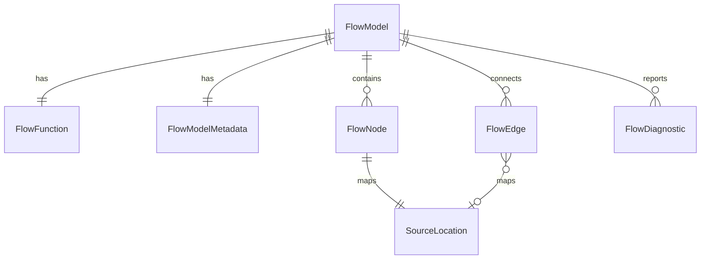
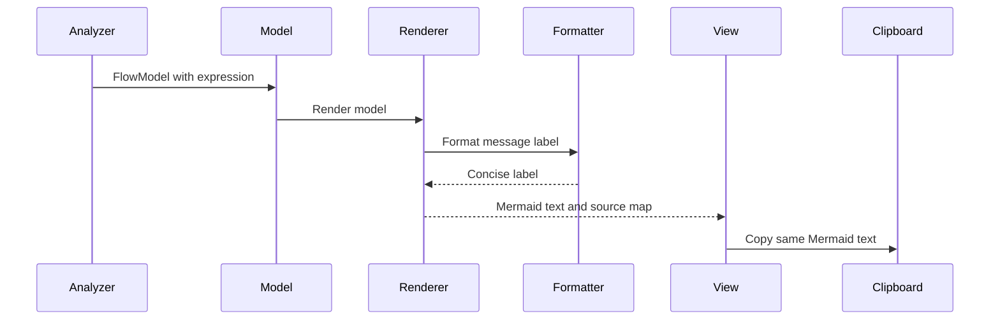
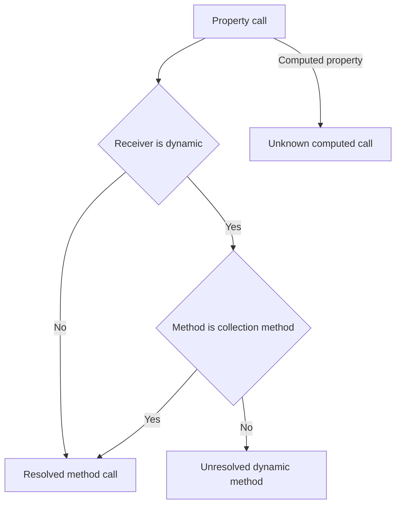
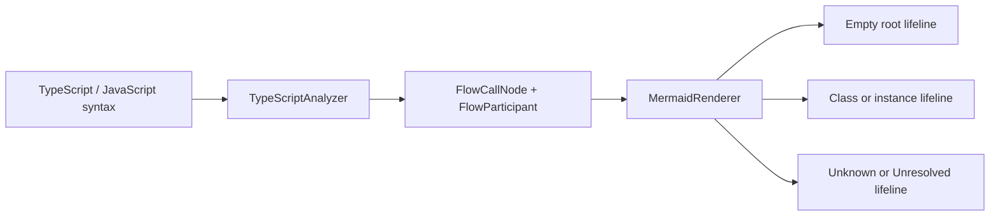

# Design Document

## Overview

Function Flow Visualization は、VS Code 上で現在読んでいる関数を静的解析し、静的処理フローと推定呼び出し順を Mermaid シーケンス図として可視化する共通基盤です。初期実装は TypeScript / JavaScript を対象とし、追加言語は言語別拡張 spec により接続します。対象ユーザーは VS Code 上で開発するエンジニア、コードレビュアー、レガシーコードの保守開発者です。

この設計は product.md、tech.md、structure.md を最優先の設計指針とし、Requirements を満たす範囲だけを対象にします。Common Flow Model を唯一の中間表現、かつ Analyzer と Renderer を接続する Stable Contract として扱います。

### Goals

- CodeLens またはカーソル位置から対象関数を特定し、静的処理フローを VS Code 上で確認できるようにする。
- Analyzer -> Common Flow Model -> Renderer の一方向依存を維持する。
- VS Code API を Integration 層へ閉じ込め、Analyzer と Renderer を VS Code 非依存にする。
- 完全解析より応答性を優先し、unknown / unresolved と部分結果をユーザーに明示する。

### Non-Goals

- TypeScript / JavaScript 以外の言語 Analyzer の初期実装。追加言語は言語別拡張 spec の責務とする。
- Sequence Diff、Test Hints、Layer Classification、Architecture Rules の実装。
- PNG / SVG Export、Markdown への直接挿入。
- LLM 連携、実行時トレース、動的呼び出しの完全解決。
- 呼び出し先関数内部の再帰的な深度解析。

## Boundary Commitments

### This Spec Owns

- VS Code command と CodeLens から対象関数を特定する Integration。
- 対象関数を入力にした Application use case。
- LanguageAnalyzer、言語非依存の Function Locator contract、および初期の TypeScript / JavaScript Analyzer。
- Common Flow Model のデータモデル、FlowEdge、metadata、FlowDiagnostic contract。
- Common Flow Model から Mermaid シーケンス図を生成する Renderer。
- 初期表示 UI と Mermaid テキストコピー。
- 制御ブロック条件ラベル（`loop`、`alt`、`opt`、`critical`、`option`）の枠線色との一致および枠上部に近い配置。
- 任意のフラグメント種別における条件ラベルの意味的な色対応。条件ラベルは対応するフラグメント種別ラベルおよび枠線と同色にする。
- 制御移動・式評価に由来する処理 Note のコンパクトな内側余白と、キャンバス背景から識別できるテーマ対応配色。
- unknown / unresolved、部分結果、キャンセル、キャッシュ、安全性に関する設計。
- 静的に推定できる実行順、`break` / `continue` の到達可能性、およびその Mermaid 表現の共通契約。

### Out of Boundary

- Future capabilities の実装。Sequence Diff、Test Hints、Layer Classification、Architecture Rules は Common Flow Model を入力とする拡張点としてのみ記述する。
- TypeScript / JavaScript 以外の言語固有 parser、Analyzer、Function Locator、構文変換、未解決判定、および言語固有 fixture の実装。これらは各言語別拡張 spec が所有する。
- PNG / SVG Export、Markdown 直接挿入。
- 外部サービス連携、LLM 連携、実行時トレース。
- Analyzer から Mermaid や表示 UI を直接生成する経路。
- 処理 Note の文言そのものを表示種別の判定根拠にすること。診断・unknown・unresolved Note の意味や通知契約を変更すること。

### Allowed Dependencies

- VS Code API: Integration 層だけが import できる。
- TypeScript Compiler API: TypeScript Analyzer だけが AST / Symbol 解析のために使用できる。
- 言語固有 parser: 各言語の `analyzers/<language>/` 境界だけが import できる。parser の AST 型は共通層へ公開しない。
- Common Flow Model: Application、Analyzer、Renderer、Integration adapter が共有できる唯一の中間 contract。
- Mermaid syntax: Renderer と表示 UI の表示責務に限定して扱う。
- Renderer の表示用 Note メタデータ: Application と VisualizationView が、コピー対象外の表示補助情報として利用できる。SourceMap の意味・形状は変更しない。

### Revalidation Triggers

- Common Flow Model の shape、node kind、diagnostic kind、source location contract が変わる場合。
- Analyzer が VS Code API、Renderer、表示 UI へ依存し始める場合。
- Renderer が AST または Analyzer 固有データを要求し始める場合。
- 表示 UI を Webview adapter 以外へ変更する場合。ただし Application、Analyzer、Renderer の contract を変更しない限り core layer の再設計は不要とする。
- TypeScript / JavaScript 以外の言語を追加する場合。
- Mermaid の Note SVG 構造、Renderer が返す処理 Note メタデータ、または Webview payload が変更される場合。
- 言語別拡張が Common Flow Model、Mermaid 表現、共通 UI、または Function Locator / LanguageAnalyzer の公開契約を変更する場合。

## Architecture

### Existing Architecture Analysis

現状は VS Code 拡張テンプレートに近く、`src/extension.ts` に hello world command があるだけです。`package.json` は command contribution、`main: ./dist/extension.js`、esbuild bundle、TypeScript strict を定義しています。既存の domain boundary はまだ存在しないため、本設計でレイヤー境界を導入します。

### Architecture Pattern & Boundary Map

選択するパターンは steering と一致する Layered Architecture です。依存方向は Integration から Renderer へ向かう一方向に限定し、下位層から上位層へ戻る import を禁止します。



Key decisions:
- Analyzer は Common Flow Model だけを返す。Mermaid 文字列、Webview HTML、Clipboard 操作は扱わない。
- Renderer は Common Flow Model だけを入力にする。AST、Symbol、Analyzer 固有データは扱わない。
- Integration は VS Code API の adapter であり、Core logic へ `vscode` 型を渡さない。

### Technology Stack

| Layer | Choice / Version | Role in Feature | Notes |
|-------|------------------|-----------------|-------|
| Runtime | VS Code extension host / `engines.vscode ^1.125.0` | Command、CodeLens、表示 UI、Clipboard | Integration 層に限定 |
| Language | TypeScript `6.0.3` / `strict` | 全体実装と型安全 | `any` は使用しない |
| Analyzer | TypeScript Compiler API | TypeScript / JavaScript の AST と Symbol 解析 | Analyzer 層に限定 |
| Renderer | Built-in TypeScript module | Common Flow Model から Mermaid 生成 | 新規依存なし |
| Build | esbuild `0.28.1` | extension bundle | 既存構成を維持 |
| Test | Mocha / VS Code Test | Core unit と VS Code integration test | テスト層を分離 |

## File Structure Plan

### Directory Structure

```text
src/
├── extension.ts
├── integration/
│   ├── commands.ts
│   ├── codeLensProvider.ts
│   ├── documentSelector.ts
│   ├── visualizationView.ts
│   ├── webviewVisualizationAdapter.ts
│   ├── clipboard.ts
│   ├── workspaceTrust.ts
│   └── vscodeAdapters.ts
├── application/
│   ├── visualizeFunctionFlow.ts
│   ├── analyzerRegistry.ts
│   ├── cache.ts
│   └── visualizationViewModel.ts
├── analyzers/
│   ├── languageAnalyzer.ts
│   ├── functionLocator.ts
│   ├── functionLocatorRegistry.ts
│   └── typescript/
│       ├── typescriptAnalyzer.ts
│       ├── functionLocator.ts
│       ├── astFlowExtractor.ts
│       └── symbolResolver.ts
├── flow-model/
│   ├── flowModel.ts
│   ├── flowNode.ts
│   ├── flowEdge.ts
│   ├── metadata.ts
│   ├── diagnostics.ts
│   └── sourceLocation.ts
├── renderer/
│   └── mermaidRenderer.ts
└── test/
    ├── unit/
    │   ├── flowModel.test.ts
    │   ├── flowEdge.test.ts
    │   ├── flowModelMetadata.test.ts
    │   ├── typescriptAnalyzer.test.ts
    │   └── mermaidRenderer.test.ts
    └── integration/
        ├── commandFlow.test.ts
        └── codeLensProvider.test.ts
```

### Modified Files

- `src/extension.ts` — extension entry を thin entry にし、commands、CodeLens、visualization view lifecycle を登録する。
- `package.json` — `glitchlens.visualizeFunctionFlow` command、CodeLens activation、workspace trust capabilities、必要な configuration を定義する。既存 hello world command は置き換え対象。
- `tsconfig.json` — `strict` を維持する。追加 compiler option は設計上必須ではない。
- `src/integration/visualizationView.ts` — WebView の表示状態、ズーム・パン操作、入力イベントの競合回避を管理し、処理 Note メタデータを Mermaid text・SourceMap と別の表示専用 payload として渡す。
- `src/integration/webviewMermaid.js` — 描画後の SVG と表示ラッパーのズーム状態を分離し、フラグメント条件ラベルを意味的に装飾するとともに、処理 Note メタデータに対応する Note だけへコンパクトなレイアウトとテーマ対応の背景・枠線・文字色を適用する。
- `src/renderer/mermaidRenderer.ts` — Mermaid text を変えず、`throw`、`break`、`continue`、`expression` の FlowNode kind から処理 Note の出力行を記録する。
- `src/flow-model/flowParticipant.ts` — 呼び出し先を表すクラス／インスタンスと `Unknown`／`Unresolved` のライフライン契約を定義する。モジュール、役割、ファイル名をライフライン名として生成しない。
- `src/flow-model/flowModel.ts`、`src/flow-model/flowNode.ts`、`src/flow-model/index.ts` — Call に `FlowParticipant` を渡す共通契約を公開する。指定関数の左端ライフラインは Renderer の固定 participant とし、関数名を FlowParticipant にしない。
- `src/flow-model/flowNode.ts`、`src/flow-model/flowEdge.ts` — `FlowBreakNode`、`FlowContinueNode`、`break-exit`、`continue-loop`、`uncertain` を言語非依存の制御フロー契約として定義する。
- `src/analyzers/typescript/typescriptAnalyzer.ts` — receiver が識別可能なクラスまたはインスタンスのときだけ `FlowParticipant` を生成し、それ以外を推測名ではなく `Unknown`／`Unresolved` として返す。標準コレクションメソッドは `Array` クラスの操作として表現する。
- `src/analyzers/typescript/typescriptAnalyzer.ts` — 入れ子 Call の評価順、Break / Continue node、loop control edge、静的順序が不確実な場合の `FlowDiagnostic` を生成する。
- `src/renderer/mermaidRenderer.ts`、`src/application/visualizeFunctionFlow.ts` — Break / Continue の処理 Note と、Mermaid で表現不能な Flow Model に対する `RendererWarning` を生成・notice 変換する。
- `src/renderer/messageLabel.ts` — Call、Return、Throw の表示用メッセージラベルを、意味を保ったまま一定長へ要約する純粋なRenderer内部ユーティリティ。
- `src/test/visualizationView.test.ts` — ボタン、ホイール、ピンチに対応するWebView操作契約と倍率境界を検証する。
- `src/test/mermaidRenderer.test.ts` — 処理 Note メタデータが固定文言ではなく FlowNode kind と Mermaid 出力行に対応することを検証する。
- `src/test/flowModelContract.test.ts`、`src/test/typescriptFlowExtractor.test.ts`、`src/test/mermaidRenderer.test.ts` — 無題の左端ライフライン、クラス／インスタンスのタイトル、要求メッセージ、同一 participant の集約、`Unknown`／`Unresolved` のフォールバックを検証する。
- `src/test/flowModelContract.test.ts`、`src/test/typescriptFlowExtractor.test.ts`、`src/test/mermaidRenderer.test.ts`、`src/test/visualizeFunctionFlowUseCase.test.ts` — Break / Continue の node と edge、評価順、FlowDiagnostic、RendererWarning、notice 変換を検証する。
- `src/test/messageLabel.test.ts` — 長い呼び出し、return 式、入れ子式、未解決呼び出しの要約規則を検証する。
- `eslint.config.mjs` — 必要に応じて core 層での `vscode` import 禁止を lint rule または review rule として補強する。

## System Flows

### Command / Cursor Flow



### CodeLens Flow



CodeLens provider は対象関数候補と command 引数だけを返します。詳細解析は command 実行後に Application が開始します。

## Requirements Traceability

| Requirement | Summary | Components | Interfaces | Flows |
|-------------|---------|------------|------------|-------|
| 1.1 | CodeLens から対象関数を特定 | CodeLensProvider, CommandController | CodeLens command args | CodeLens Flow |
| 1.2 | カーソル位置から対象関数を特定 | CommandController, FunctionLocator | VisualizationRequest | Command Flow |
| 1.3 | 対象関数なしを通知 | CommandController, VisualizationView | VisualizationError | Command Flow |
| 1.4 | 非対応言語を通知 | DocumentSelector, CommandController | SupportedLanguage | Command Flow |
| 2.1 | 対象コードを実行しない | TypeScriptAnalyzer | AnalyzerInput | Command Flow |
| 2.2 | 処理順序を保持 | AstFlowExtractor, FlowModel | FlowNode.order | Command Flow |
| 2.3 | Call を抽出 | AstFlowExtractor | FlowCallNode | Command Flow |
| 2.4 | Branch Loop Await Return Throw TryCatch を識別 | AstFlowExtractor | FlowNode union | Command Flow |
| 2.5 | 深度解析しない | TypeScriptAnalyzer | AnalyzerConfig.maxDepth | Command Flow |
| 3.1 | 元コード順序を保持表示 | FlowModel, MermaidRenderer, VisualizationView | FlowNode.order, FlowEdge.executionOrder, SourceLocation | Command Flow |
| 3.2 | 元コード追跡情報を表示 | VisualizationView, FlowModel | SourceLocation, RenderSourceMapEntry | Command Flow |
| 3.3 | 推定呼び出し順を一貫表示 | FlowModel, MermaidRenderer | FlowNode.order, FlowEdge.executionOrder | Command Flow |
| 3.4 | 順序不確定箇所を区別 | FlowDiagnostic, VisualizationView | Diagnostic severity | Command Flow |
| 4.1 | Mermaid テキスト生成 | MermaidRenderer | RenderResult | Command Flow |
| 4.2 | VS Code 上に表示 | VisualizationView | VisualizationResult | Command Flow |
| 4.3 | 静的処理フローを視覚確認 | VisualizationView, MermaidRenderer | VisualizationViewModel | Command Flow |
| 4.4 | 制御ブロックの種類別装飾 | VisualizationView, webviewMermaid.js | SVG decoration contract | Mermaid Render Flow |
| 4.5 | 部分結果を表示 | Application, VisualizationView | PartialAnalysisResult | Command Flow |
| 5.1 | コピー操作提供 | VisualizationView, ClipboardAdapter | CopyCommand | Command Flow |
| 5.2 | Mermaid テキストを保存 | ClipboardAdapter | MermaidText | Command Flow |
| 5.3 | コピー不可理由を通知 | ClipboardAdapter, VisualizationView | VisualizationError | Command Flow |
| 6.1 | unknown unresolved 表示 | TypeScriptAnalyzer, MermaidRenderer | UnknownCallNode | Command Flow |
| 6.2 | 未解決要素を認識可能にする | Application, VisualizationView | VisualizationNotice | Command Flow |
| 6.3 | 解析範囲を表示 | Application, VisualizationView | PartialAnalysisResult | Command Flow |
| 6.4 | 解析済みと未解析を区別 | VisualizationView | VisualizationNotice | Command Flow |
| 6.5 | 動的呼び出し完全解決を保証しない | TypeScriptAnalyzer | Diagnostic kind | Command Flow |
| 7.1 | ソースコードを外部送信しない | All components | Local-only boundary | Command Flow |
| 7.2 | 解析結果を外部送信しない | All components | Local-only boundary | Command Flow |
| 7.3 | LLM 連携しない | Boundary | None | None |
| 7.4 | 実行時トレースしない | TypeScriptAnalyzer | Static-only analyzer | Command Flow |
| 8.1 | 通常規模で即時確認 | Application, Cache | CacheKey with analyzer version, cancellation | Command Flow |
| 8.2 | 解析中状態を表示 | CommandController, VisualizationView | Progress state | Command Flow |
| 8.3 | 編集操作を継続可能 | Application | CancellationToken adapter | Command Flow |
| 8.4 | 応答性優先で部分結果 | Application, TypeScriptAnalyzer | PartialAnalysisResult | Command Flow |
| 8.5 | 失敗理由を提示 | Application, VisualizationView | VisualizationError | Command Flow |
| 9.1-9.3 | 100%の固定基準サイズと大規模図のスクロール | VisualizationView, webviewMermaid.js | DisplayState, intrinsic SVG sizing | Viewer Flow |
| 9.4-9.6 | Fit、手動倍率変更、100%リセット | VisualizationView | DisplayState, Fit calculation | Viewer Flow |
| 9.7-9.9 | 縦横比、倍率範囲、表示操作との非干渉 | VisualizationView, webviewMermaid.js | ZoomBounds, display wrapper contract | Viewer Flow |
| 9.10-9.12 | Pan、入力抑止、fallback | VisualizationView, webviewMermaid.js | PanState, Fallback view | Viewer Flow |
| 9.13-9.14 | 余白と描画失敗時fallback | webviewMermaid.js, VisualizationView | Mermaid sequence configuration | Mermaid Render Flow |
| 9.15-9.18 | ホイール、ピンチ、倍率境界、通常スクロール | VisualizationView | Wheel, Pinch, input arbitration policies | Viewer Flow |
| 9.23 | メッセージ間隔を維持したメッセージラベルの位置調整 | webviewMermaid.js | Message label decoration contract | Mermaid Render Flow |
| 10.1 | 内部状態名を表示しない | VisualizationView | VisualizationViewModel display boundary | Viewer Flow |
| 10.2 | user-visible notice を維持する | VisualizationView | VisualizationNotice | Viewer Flow |
| 10.3 | 状態管理と通知契約を変更しない | VisualizationView | VisualizationViewModel | Viewer Flow |
| 10.4 | 操作コントロールを指定順・左寄せの一行にする | VisualizationView | toolbar DOM contract | Viewer Flow |
| 10.5 | 現在倍率を非操作表示にする | VisualizationView | DisplayState | Viewer Flow |
| 10.6 | 狭い幅でも順序を維持する | VisualizationView | toolbar CSS contract | Viewer Flow |
| 10.7 | ズームボタンのテーマとコントラストを維持する | VisualizationView | VS Code theme variables | Viewer Flow |
| 10.8 | hover、focus、disabled の状態を表示する | VisualizationView | CSS state contract | Viewer Flow |
| 10.9 | Copy Mermaid の控えめなテーマ配色を維持する | VisualizationView | VS Code theme variables | Viewer Flow |
| 10.10 | WebView UI変更時の既存通信契約を維持する | VisualizationView, ClipboardAdapter | viewId, copyMermaid message | Viewer Flow |
| 11.1-11.5 | 任意のフラグメント条件ラベルの色対応、位置、既存内容の非変更 | webviewMermaid.js, VisualizationView | Control label decoration contract | Mermaid Render Flow |
| 12.1-12.6 | 処理 Note の内側余白、テーマ識別性、意味的判定、既存契約の維持 | MermaidRenderer, VisualizeFunctionFlowUseCase, VisualizationView, webviewMermaid.js | ProcessNoteDecoration, VisualizationViewModel | Mermaid Render Flow |
| 13.1 | 呼び出しメッセージを呼び出し先中心の簡潔なラベルにする | MermaidRenderer, MessageLabelFormatter | MermaidText, FlowCallNode | Mermaid Render Flow |
| 13.2 | return / throw の複合式を短い概要へ要約する | MermaidRenderer, MessageLabelFormatter | MermaidText, FlowNode | Mermaid Render Flow |
| 13.3 | 長いラベルを表示上限内へ収める | MessageLabelFormatter | MessageLabelPolicy | Mermaid Render Flow |
| 13.4 | 方向、順序、participant、未解決状態、コード対応を維持する | MermaidRenderer, RenderSourceMap | RenderSourceMapEntry, FlowEdge | Mermaid Render Flow |
| 13.5 | コピー対象にも簡潔なラベルを反映する | MermaidRenderer, VisualizationView, ClipboardAdapter | MermaidText | Command Flow |
| 14.1 | 静的にコレクションメソッドと判断できる呼び出しを resolved として扱う | TypeScriptAnalyzer | FlowCallNode, CallResolution | Command Flow |
| 14.2 | コレクションメソッド名を participant とメッセージへ表示する | TypeScriptAnalyzer, MermaidRenderer | FlowCallNode, MermaidText | Mermaid Render Flow |
| 14.3 | 動的オブジェクト・計算プロパティの unknown / unresolved 契約を維持する | TypeScriptAnalyzer, MermaidRenderer | CallResolution, FlowDiagnostic | Command Flow |
| 14.4 | SourceMap、コードジャンプ、部分解析、処理順序を維持する | TypeScriptAnalyzer, MermaidRenderer, VisualizationView | SourceLocation, RenderSourceMapEntry | Command Flow |
| 14.5 | 判定規則更新時に旧解析キャッシュを再利用しない | TypeScriptAnalyzer, AnalysisCache | analyzer version, CacheKey | Command Flow |
| 15.1 | 入れ子呼び出しを静的な実行順で表現する | TypeScriptAnalyzer, FlowModel | FlowNode.order | Command Flow |
| 15.2 | inner を outer より前に表現する | TypeScriptAnalyzer, FlowModel | FlowEdge.executionOrder | Command Flow |
| 15.3 | break 後の到達可能経路を表現する | TypeScriptAnalyzer, FlowModel, MermaidRenderer | FlowBreakNode, break-exit | Command Flow |
| 15.4 | continue の次反復経路を表現する | TypeScriptAnalyzer, FlowModel, MermaidRenderer | FlowContinueNode, continue-loop | Command Flow |
| 15.5 | 静的順序の不確実性と Mermaid 表現不能を明示する | TypeScriptAnalyzer, MermaidRenderer, Application, VisualizationView | FlowDiagnostic, RendererWarning, VisualizationNotice | Mermaid Render Flow |
| 16.1 | 指定関数を最左の無題ライフラインにする | MermaidRenderer | fixed root participant | Mermaid Render Flow |
| 16.2 | クラス名またはインスタンス名をライフラインにする | TypeScriptAnalyzer, FlowParticipant, MermaidRenderer | FlowParticipant | Mermaid Render Flow |
| 16.3 | 要求する操作をメッセージにする | MermaidRenderer, MessageLabelFormatter | FlowCallNode.calleeName | Mermaid Render Flow |
| 16.4 | 同一主体だけを同じライフラインへ集約する | MermaidRenderer | FlowParticipant.key | Mermaid Render Flow |
| 16.5 | 識別不能な主体を Unknown / Unresolved に集約する | TypeScriptAnalyzer, MermaidRenderer | FlowParticipantKind | Mermaid Render Flow |
| 16.6 | 図とコピー内容を一致させる | MermaidRenderer, VisualizationView, ClipboardAdapter | RenderResult | Command Flow |
| 16.7 | 関数先頭の表示可能な呼び出しを省略しない | MermaidRenderer, VisualizationView, ClipboardAdapter | renderer entry-call rule, RenderSourceMapEntry | Mermaid Render Flow |

## Components and Interfaces

| Component | Domain / Layer | Intent | Req Coverage | Key Dependencies | Contracts |
|-----------|----------------|--------|--------------|------------------|-----------|
| ExtensionEntry | VS Code Integration | 拡張の登録入口 | 1.1, 1.2, 5.1 | Commands P0, CodeLens P1 | Service |
| CommandController | VS Code Integration | command 実行と通知 | 1.2, 1.3, 4.2, 8.2 | Application P0 | Service |
| CodeLensProvider | VS Code Integration | 関数上の起動 UI | 1.1 | FunctionLocator P1 | Service |
| VisualizationView | VS Code Integration | 表示方式に依存しない可視化表示境界 | 3.1, 4.2, 4.4, 6.4, 12.2, 12.3, 12.6 | VisualizationViewModel P0 | State |
| ClipboardAdapter | VS Code Integration | Mermaid text copy | 5.1, 5.2, 5.3 | VS Code Clipboard P0 | Service |
| VisualizeFunctionFlowUseCase | Application | 解析から表示用結果までの orchestration | 1.2, 2.1, 4.5, 8.4, 12.4, 12.6 | Analyzer P0, Renderer P0, Cache P1 | Service |
| AnalyzerRegistry | Application | language id から Analyzer を選択 | 1.4, 2.1 | LanguageAnalyzer P0 | Service |
| FunctionLocatorRegistry | Analyzer | language id から Function Locator を選択 | 1.1, 1.2 | FunctionLocator P0 | Service |
| AnalysisCache | Application | document version と analyzer version 単位の再利用 | 8.1, 8.3 | CacheKey P1 | State |
| LanguageAnalyzer | Analyzer | 全 Analyzer の共通契約 | 2.1, 2.4, 6.3 | FlowModel P0 | Service |
| TypeScriptAnalyzer | Analyzer | TS JS 静的解析 | 2.1, 2.3, 2.4, 6.1 | TypeScript Compiler API P0 | Service |
| FunctionLocator | Analyzer | cursor と CodeLens から対象関数を解決する言語非依存 contract | 1.1, 1.2 | language-specific parser P0 | Service |
| FlowModel | Common Model | 唯一の中間表現 | 2.2, 3.1, 3.3 | None P0 | State |
| FlowEdge | Common Model | 制御構造と実行順序の接続表現 | 2.4, 3.1, 3.4 | FlowNode P0 | State |
| FlowModelMetadata | Common Model | 解析結果の由来と cache invalidation 情報 | 7.2, 8.1 | Analyzer P0 | State |
| MermaidRenderer | Renderer | Mermaid sequence diagram と処理 Note 表示メタデータの生成 | 4.1, 6.1, 12.4, 12.6 | FlowModel P0 | Service |

### VS Code Integration

#### ExtensionEntry

| Field | Detail |
|-------|--------|
| Intent | extension activation 時に Integration component を登録する |
| Requirements | 1.1, 1.2, 5.1 |

**Responsibilities & Constraints**
- `activate` は command、CodeLens、display/clipboard adapters の登録だけを行う。
- VS Code API import は Integration 配下と `extension.ts` に限定する。
- `context.subscriptions` へ Disposable を集約する。

**Contracts**: Service [x] / State [ ] / API [ ] / Event [ ]

#### CommandController

| Field | Detail |
|-------|--------|
| Intent | user action を plain request に変換し Application を呼ぶ |
| Requirements | 1.2, 1.3, 1.4, 4.2, 8.2, 8.5 |

**Responsibilities & Constraints**
- `TextDocument`、`Position`、`CancellationToken` を Integration 内で plain data へ変換する。
- 対象関数なし、非対応言語、解析失敗をユーザー通知へ変換する。
- 解析中 state を表示 UI に通知する。
- Application が返す `VisualizationViewModel` を VisualizationView へ渡す。CommandController は Mermaid 生成や FlowModel 変換を行わない。

##### Service Interface

```typescript
interface CommandController {
  visualizeFromCursor(command: CursorCommandInput): Promise<void>;
  visualizeFromCodeLens(command: CodeLensCommandInput): Promise<void>;
}
```

#### CodeLensProvider

| Field | Detail |
|-------|--------|
| Intent | 対応言語の関数付近に軽量な起動 affordance を提供する |
| Requirements | 1.1, 8.3 |

**Responsibilities & Constraints**
- 関数候補と range の検出に留め、詳細解析は行わない。
- cancellation request を尊重し、古い CodeLens 計算を破棄する。

#### VisualizationView

| Field | Detail |
|-------|--------|
| Intent | VS Code 上で Mermaid 図、未解決要素、解析不能箇所を表示する |
| Requirements | 3.1, 3.2, 4.2, 4.3, 6.2, 6.4 |

**Responsibilities & Constraints**
- 表示方式に依存しない Integration 境界として、Application から受け取った `VisualizationViewModel` を VS Code 上へ表示する。
- 初期実装では Webview adapter を利用する。
- 将来 Sidebar、Panel、Custom Editor へ変更しても、Application、Analyzer、Renderer を変更しない。
- Webview adapter では CSP、nonce、`localResourceRoots` 最小化を適用する。
- 表示 UI は Analyzer 固有データ、Renderer の戻り値、FlowDiagnostic、RendererWarning を直接受け取らず、Application が生成した `VisualizationViewModel` とユーザー向け `VisualizationNotice` だけを扱う。
- Mermaid sequence diagram の描画は Webview 内でローカル bundle された Mermaid 公式 Renderer を使用し、外部 CDN や外部ネットワークを使用しない。
- Mermaid 初期化時の theme variables は VS Code theme から解決済みの実色だけを渡し、`currentColor` や未解決の CSS variable は渡さない。実色として解決できない場合は Dark Theme に馴染む安全な fallback 色を使用する。
- Mermaid 描画に失敗した場合は、Application や Renderer の契約を変更せず、表示層で Mermaid text を fallback 表示する。
- Mermaid text、Common Flow Model、SourceMap contract は表示改善のために変更しない。制御構造と処理 Note の配色・装飾は Visualization / Webview 層の責務とする。
- `loop`、`alt`、`opt`、`critical`、`option` は Webview が描画済み SVG を装飾し、種類ごとに異なるアクセントカラーを枠線、ラベル、必要な文字色へ適用する。
- 条件ラベルの文字色は、意味的に対応する任意のフラグメント種別ラベルおよび枠線と同一の実色にする。関数ごとに異なる条件文言、フラグメント数、ネスト構造を扱い、DOM順・画面上の距離ではなく、Mermaidのフラグメント構造または描画前に保持した意味情報から決定する。
- 条件ラベルの配置は描画後の表示用 `transform` で上方へ調整し、対応する枠の上部に近づける。フラグメント種別ラベルの位置は変更しない。Mermaid text、制御ブロックの範囲、メッセージ間隔、SVGのレイアウト属性は変更しない。
- Control Block の枠線・ラベル色は Mermaid 既定の `.loopLine` 等との競合を避けるため、nonce付きWebviewスタイルシートで `#diagram svg` を起点とする高詳細度セレクタと `!important` を用いて、描画後に付与した対象 SVG shape と label text のクラスを装飾する。これにより、SVG内のMermaid規則より優先して評価され、Webview CSP によりブロックされる動的な `style.setProperty` へ依存しない。枠線は `stroke-dasharray: none`、`stroke-width: 1.8px` とし、`loop` `#9fd0ff`、`alt` `#8ff2ff`、`opt` `#fde68a`、`critical` `#ddd6fe`、`option` `#fbcfe8` を使用する。制御ラベル枠の横幅やfont-sizeを追加調整する専用定義値は設けず、Mermaid の自然な幅計算を維持する。
- ライフラインと participant 境界線は Webview CSS で背景へ埋もれない明るいグレー系へ調整し、root function の participant は他 participant より少し強い枠線と背景で強調する。
- 実行中の区間は Webview が描画用 Mermaid text に `activate` / `deactivate` を補助的に加えて Mermaid の activation 表示を利用する。この補助は Webview 内の描画入力だけに限定し、コピー対象の Mermaid text、Common Flow Model、Renderer contract は変更しない。
- `await` 呼び出しと `return` は Webview が描画済み SVG を装飾し、await は通常 call と区別できるアクセントカラー、return は控えめな色で call と区別する。
- Renderer は引き続き Mermaid text の生成のみを担当し、ライフライン、activation、await / return、root participant の配色やテーマ適用は Visualization / Webview 層の責務とする。
- root participant は対象関数の開始から終了まで常時 activation 表示し、解析対象と処理全体の起点を明示する。他 participant は Call / Await の実行期間だけ activation 表示する。
- ライフラインはダークテーマ上で埋もれない白系にし、activation、文字、矢印より目立ちすぎない太さと opacity に調整する。
- Control Block は `loop` Blue、`alt` Cyan、`opt` Yellow、`critical` Purple、`option` Magenta のアクセントを枠線、ラベル、タブへ適用し、淡いグレー基調へ寄せない。
- 長い participant 名、条件式、Call / Await ラベルが途中で切れないよう、Webview 側で Mermaid sequence の participant 間隔、message 間隔、box padding、SVG overflow、text layout を調整する。
- Mermaid のレイアウト計算結果を尊重し、SVG 生成後に `textLength`、`lengthAdjust`、SVG text の `font-size` を破壊的に変更しない。
- 100%表示では `useMaxWidth: false` を使用し、Mermaidが計算したSVGの自然サイズを維持する。WebView幅を超える図は表示ラッパー内でスクロールし、自動縮小しない。文字切れ対策はSVG後処理ではなく、Mermaid sequence設定の余白や幅計算を優先して調整する。
- participant 名は上下の actor box 内で水平方向・垂直方向に中央揃えし、十分な上下左右の余白を確保する。SVG 生成後は対応する actor の `text` 要素へ `text-anchor: middle`、`dominant-baseline: middle`、`alignment-baseline: middle` を付与する。
- Mermaid が生成した `x`、`y`、`textLength`、`lengthAdjust` は維持し、participant 名のはみ出し防止は Mermaid のレイアウト計算を優先する。SVG 生成後にこれらの text 属性を破壊的に変更しない。
- メッセージラベルと線の距離は Webview の描画後処理で調整する。メッセージラベルの `text` 要素だけを識別し、専用の `translateY` 値（初期値は `20px`）を `transform` に追加して下げる。Mermaid が生成した `x`、`y`、`textLength`、`lengthAdjust`、font-size は変更しない。
- メッセージラベルの位置調整は SVG のラベル要素だけに適用し、メッセージ線、矢印、activation、participant、control block には適用しない。`messageMargin: 70` は維持し、メッセージ間の縦方向の間隔を変更しない。
- Mermaid sequence の `noteMargin` は `12` とし、Note の文字周囲と必要寸法をコンパクトにする。`messageMargin`、participant、activation、control block の余白設定は変更しない。
- Renderer が FlowNode kind から返した `ProcessNoteDecoration` を Webview payload にそのまま渡す。Webview は Mermaid text 内の Note 行と描画済み Note group の対応を、文言・画面上の距離・他フラグメントの DOM 子孫検索ではなく、出力行番号と Note 出現順だけで復元する。対応が一意に復元できない場合は装飾を適用せず、Mermaid の既定表示を維持する。
- 処理 Note の対象 kind は `throw`、`break`、`continue`、`expression` とする。`unknown`、`unresolved`、`order-uncertain`、診断由来の Note は対象に含めない。対象判定は FlowNode kind だけで行い、`continue`、`break`、`retry++` などの表示文言との一致判定を行わない。
- 処理 Note の背景色はキャンバス背景 `--vscode-editor-background` に `--vscode-textLink-foreground` を 18% 混ぜたテーマ対応色とし、`editorWidget` 背景がキャンバスと同色になるテーマでも識別できるようにする。枠線は `--vscode-editorWidget-border`、文字色は `--vscode-editor-foreground` を優先する。変数が具体色へ解決できないテーマでは、キャンバス背景と区別できる fallback 背景・枠線・文字色を使用する。SVG 内 Mermaid スタイルとの優先順位を確保するため、nonce 付き Webview stylesheet の `#diagram svg` 起点の高詳細度セレクタと `!important` を使用する。
- 処理 Note の装飾は背景、枠線、文字色だけに限定する。Note の Mermaid text、SourceMap、処理順、コードジャンプ、コピー対象、描画失敗時 fallback、および条件ラベル・フラグメント装飾を変更しない。
- `SourceMap` は内部データとして `VisualizationViewModel` に保持するが、Marketplace 公開版の Webview では画面下部の Source locations 一覧を表示しない。
- Copy Mermaid は表示中の Mermaid text をコピーする既存操作として維持し、SVG 装飾や Source locations 非表示の影響を受けない。

#### ClipboardAdapter

| Field | Detail |
|-------|--------|
| Intent | 現在表示中の Mermaid テキストを VS Code Clipboard へ保存する |
| Requirements | 5.1, 5.2, 5.3 |

**Responsibilities & Constraints**
- Clipboard API の利用を Integration 層に閉じ込める。
- コピー対象がない場合はユーザー通知へ変換する。

### Application

#### VisualizeFunctionFlowUseCase

| Field | Detail |
|-------|--------|
| Intent | 対象関数特定済み request を Analyzer と Renderer へ渡して表示可能な結果へまとめる |
| Requirements | 2.1, 4.5, 6.3, 8.1, 8.4 |

**Responsibilities & Constraints**
- Analyzer 選択、解析開始、Renderer 呼び出し、部分結果処理を調停する。
- Mermaid syntax、AST、VS Code API を直接扱わない。
- 完全解析失敗時も部分結果がある場合は `VisualizationResult` を返す。
- FlowDiagnostic と RendererWarning をユーザー向け `VisualizationNotice` へ変換し、VisualizationView へ渡せる形にする。
- Application は具体的な表示方式を知らない。

##### Service Interface

```typescript
interface VisualizeFunctionFlowUseCase {
  execute(input: VisualizationRequest): Promise<VisualizationResult>;
}
```

#### AnalyzerRegistry

| Field | Detail |
|-------|--------|
| Intent | language id から利用可能な Analyzer を選択する |
| Requirements | 1.4, 2.1 |

**Responsibilities & Constraints**
- 初期登録は TypeScript / JavaScript Analyzer とし、言語別拡張 spec は同じ公開契約で Analyzer を追加登録する。
- 未対応言語は user-visible error へ変換可能な error envelope を返す。

#### AnalysisCache

| Field | Detail |
|-------|--------|
| Intent | document URI、version、function range、configuration、analyzer id、analyzer version 単位で結果を再利用する |
| Requirements | 8.1, 8.3, 8.4 |

**Responsibilities & Constraints**
- document change で該当 document の cache を無効化する。
- cache key には document URI、document version、function range、configuration digest、analyzer id、analyzer version を必ず含める。
- Analyzer の解析ロジックまたは Common Flow Model 変換仕様が変わる場合は analyzer version を変更し、古い結果を再利用しない。
- 部分結果も cache 可能だが、source version が一致する場合だけ使用する。
- cache は外部永続化しない。

### Analyzer

#### LanguageAnalyzer Interface

| Field | Detail |
|-------|--------|
| Intent | すべての Analyzer が従う共通契約 |
| Requirements | 2.1, 2.4, 6.3 |

##### Service Interface

```typescript
interface LanguageAnalyzer {
  readonly languageIds: readonly string[];
  analyze(input: AnalyzerInput): Promise<AnalyzerResult>;
}

interface FunctionLocator {
  readonly languageIds: readonly string[];
  findFunctionCandidates(source: SourceFileInput): readonly FunctionCandidate[];
  findFunctionContainingOffset(source: SourceFileInput, offset: number): FunctionLocatorResult;
}

interface AnalyzerInput {
  source: SourceFileInput;
  cursorOffset: number;
  configuration: AnalyzerConfiguration;
  cancellation: CancellationSignal;
}

interface AnalyzerResult {
  model: FlowModel;
  diagnostics: readonly FlowDiagnostic[];
  completeness: AnalysisCompleteness;
}
```

**Invariants**
- Analyzer は VS Code API、Renderer、VisualizationView、他言語 Analyzer に依存しない。
- Analyzer は Mermaid テキストを生成しない。
- Analyzer は対象コードを実行しない。
- Analyzer は入れ子の call を、静的に推定できる実行順で FlowModel へ追加する。たとえば `outer(inner())` は `inner`、`outer` の順とする。
- Function Locator は言語別に候補を取得するが、CodeLens と cursor からの対象特定に共通 contract を提供する。

#### TypeScriptAnalyzer

| Field | Detail |
|-------|--------|
| Intent | TypeScript / JavaScript の AST と Symbol 情報から FlowModel を生成する |
| Requirements | 2.1, 2.2, 2.3, 2.4, 2.5, 6.1, 6.5, 15.1, 15.2, 15.3, 15.4, 15.5 |

**Responsibilities & Constraints**
- TypeScript Compiler API で SourceFile を作成し、cursor offset から対象関数を特定する。
- 対象関数 body の statement order を保持して FlowNode と FlowEdge を生成する。
- call expression、branch、loop、await、return、throw、break、continue、try/catch を抽出する。
- branch、loop、try/catch の接続関係は FlowEdge として生成する。Break は現在の loop context に記録し、ループ後に最初に到達可能な node がある場合だけ `break-exit` edge を生成する。Continue は現在の loop node へ `continue-loop` edge を生成する。
- 静的解析だけでは評価順を確定できない場合は、`order-uncertain` の `FlowDiagnostic` と必要な `uncertain` edge を返す。Mermaid の表現可否は判定しない。
- 呼び出し先内部へ深度解析しない。
- 静的に解決できない call は `unknown` または `unresolved` diagnostic 付きの node とする。
- `analyzerId` と `analyzerVersion` を FlowModel metadata に設定する。

### Common Flow Model

#### FlowModel

| Field | Detail |
|-------|--------|
| Intent | Analyzer と Renderer を接続する唯一の Stable Contract。FlowNode、FlowEdge、metadata を含む |
| Requirements | 2.2, 3.1, 3.3, 3.4, 6.1, 6.2 |

##### State Contract

```typescript
type FlowNode =
  | FlowCallNode
  | FlowBranchNode
  | FlowLoopNode
  | FlowAwaitNode
  | FlowReturnNode
  | FlowThrowNode
  | FlowBreakNode
  | FlowContinueNode
  | FlowExpressionNode
  | FlowTryCatchNode;

interface FlowBreakNode extends BaseFlowNode {
  readonly kind: 'break';
  readonly label?: string;
}

interface FlowContinueNode extends BaseFlowNode {
  readonly kind: 'continue';
  readonly label?: string;
}

type FlowEdgeKind =
  | 'next'
  | 'true'
  | 'false'
  | 'loop-body'
  | 'loop-exit'
  | 'break-exit'
  | 'continue-loop'
  | 'try'
  | 'catch'
  | 'finally'
  | 'return'
  | 'throw'
  | 'uncertain';

interface FlowEdge {
  id: FlowEdgeId;
  sourceNodeId: FlowNodeId;
  targetNodeId: FlowNodeId;
  kind: FlowEdgeKind;
  executionOrder: number;
  label?: string;
  condition?: string;
  sourceLocation?: SourceLocation;
}

interface FlowModel {
  metadata: FlowModelMetadata;
  rootFunction: FlowFunction;
  nodes: readonly FlowNode[];
  edges: readonly FlowEdge[];
  diagnostics: readonly FlowDiagnostic[];
  source: FlowSource;
  completeness: AnalysisCompleteness;
}

interface FlowModelMetadata {
  schemaVersion: string;
  analyzerId: string;
  analyzerVersion: string;
  languageId: string;
  generatedAt: string;
  sourceDocumentVersion: number;
  completeness: AnalysisCompleteness;
  configurationDigest: string;
  rootFunctionIdentifier?: string;
}
```

**Required Fields**
- FlowNode `id`: stable within one analysis result.
- FlowNode `kind`: discriminated union key.
- FlowNode `order`: 静的に推定できる実行順を保つ単調増加順序。
- FlowNode `sourceLocation`: file URI string, range, and optional symbol display name.
- `FlowBreakNode` と `FlowContinueNode`: いずれも statement 自体の `sourceLocation` と静的に推定した実行順の `order` を持つ。label 付き statement では label を保持する。
- FlowNode `resolution`: `resolved`, `unknown`, or `unresolved` for call-like nodes.
- FlowEdge `sourceNodeId` and `targetNodeId`: node connection endpoints.
- FlowEdge `kind`: `next`、`true`、`false`、`loop-body`、`loop-exit`、`break-exit`、`continue-loop`、`try`、`catch`、`finally`、`return`、`throw`、`uncertain` のいずれか。
- FlowEdge `executionOrder`: edge traversal order.
- FlowEdge optional fields: label、condition、sourceLocation。
- Metadata: analyzer id、analyzer version、language id、generated at、source document version、completeness、configuration digest、schema version。

**Invariants**
- AST node、TypeScript symbol、VS Code object は FlowModel に含めない。
- TypeScript AST や Symbol 情報を FlowEdge に直接保持しない。
- Branch、Loop、Try/Catch の接続関係は FlowEdge で表現する。
- Break と Continue は制御移動そのものを表す独立 node とし、後続の通常 `next` edge を持たない。
- FlowNode と FlowEdge の両方を Common Flow Model の Stable Contract とする。
- Metadata は言語固有 AST や VS Code object を保持しない。
- Renderer と future extension points は FlowModel だけを入力にする。
- Model shape changes are revalidation triggers.

### Renderer

#### MermaidRenderer

| Field | Detail |
|-------|--------|
| Intent | FlowModel の nodes と edges から Mermaid sequence diagram text と source map を生成する |
| Requirements | 3.1, 3.3, 4.1, 4.3, 5.2, 6.1 |

##### Service Interface

```typescript
interface MermaidRenderer {
  render(model: FlowModel): RenderResult;
}

interface RenderResult {
  mermaidText: string;
  warnings: readonly RendererWarning[];
  sourceMap: readonly RenderSourceMapEntry[];
  processNoteDecorations: readonly ProcessNoteDecoration[];
}

interface ProcessNoteDecoration {
  mermaidLine: number;
  nodeKind: 'throw' | 'break' | 'continue' | 'expression';
}
```

**Responsibilities & Constraints**
- FlowNode と FlowEdge の `order` / `executionOrder` に従って Mermaid sequence diagram を生成する。
- Mermaid 内要素と Source Location を対応付ける source map を生成する。
- `throw`、`break`、`continue`、`expression` を `Note` として出力した行について、表示専用の `ProcessNoteDecoration` を記録する。文字列の内容は記録・判定に使用しない。
- `ProcessNoteDecoration` は Mermaid text の行番号と FlowNode kind だけを持つ。SourceMap の既存 entry を再利用・変更せず、Analyzer 固有情報、AST、VS Code API、表示用の色値を含めない。
- unknown / unresolved は明示的な participant または note として表示可能な形にする。
- Renderer は AST、Analyzer 固有データ、VS Code API を扱わない。
- Renderer は Webview、表示文言の詳細、UI 固有 diagnostic 型を扱わない。
- 表現できない model 要素がある場合は UI 非依存な `RendererWarning` として返す。
- 現時点では `MermaidRenderer` を明示的な実装対象とし、PlantUML など将来形式は実装しない。
- Renderer interface は Common Flow Model を入力にする独立 contract として維持するが、過剰な generic abstraction は導入しない。
- PNG / SVG Export は実装しない。

## Data Models

### Domain Model



### Logical Data Model

- `SourceFileInput`: `uri`, `languageId`, `version`, `text` を持つ plain input。
- `VisualizationRequest`: source、cursor offset、configuration、cancellation を持つ Application input。
- `FlowModel`: metadata、root function、ordered nodes、edges、diagnostics、source metadata、completeness を持つ stable contract。
- `FlowEdge`: source node id、target node id、edge kind、execution order、optional label、optional condition、optional source location を持つ制御接続。
- `FlowModelMetadata`: analyzer id、analyzer version、language id、generated at、source document version、completeness、configuration digest、schema version、optional root function identifier を持つ。
- `ProcessNoteDecoration`: Mermaid 出力行と `throw`、`break`、`continue`、`expression` のいずれかの FlowNode kind を持つ、コピー対象外の表示専用メタデータ。
- `RenderResult`: Mermaid text、renderer warnings、source map、process note decorations を持つ Renderer result。
- `VisualizationResult`: render result、partial flag、FlowDiagnostic と RendererWarning から変換された user-visible notices、process note decorations を持つ Application output。
- `VisualizationViewModel`: Mermaid text、SourceMap、notice と独立して process note decorations を Webview に渡す。fallback model では空配列とする。

### Data Contracts & Integration

- Source text は process memory 内だけで扱い、外部送信も永続化もしない。
- Cache key は document URI、document version、function range、configuration digest、analyzer id、analyzer version で構成する。
- Source location は表示 UI の追跡情報に使うが、AST object を露出しない。
- Analyzer の解析ロジックまたは Common Flow Model 変換仕様が変わった場合は analyzer version を更新し、古い cache entry を再利用しない。
- Metadata は Sequence Diff、Test Hints、キャッシュ、トラブルシュートで利用できる安定情報とする。ただしこの spec では Sequence Diff と Test Hints は実装しない。

### Cross-language Execution Order and Loop Control

- `FlowNode.order` と `FlowEdge.executionOrder` は、単純なソース位置順ではなく、Analyzer が静的に推定できる評価・実行順を表す。入れ子の call は子の評価を親の call より先に表現する。
- `FlowBreakNode` は break statement の `sourceLocation` と `order` を持つ。`break-exit` はこの node から、当該ループ後に最初に到達可能な node へ接続する。後続 node が存在しない場合は edge を作らず、Break node を terminal とする。
- `FlowContinueNode` は continue statement の `sourceLocation` と `order` を持つ。`continue-loop` はこの node から、最も内側の対応する loop node へ接続する。Renderer はこの edge を次の反復として扱い、通常の逐次 `next` edge として解釈しない。
- Analyzer は静的に順序を確定できないときだけ `order-uncertain` の `FlowDiagnostic` と `uncertain` edge を生成する。Application はこの diagnostic を user-visible notice に変換する。
- Renderer は Flow Model の edge または node の組合せを Mermaid の構造化制御構文へ変換できないときだけ `RendererWarning` を返す。Application はこの warning を diagnostic とは別の user-visible notice に変換する。RendererWarning は Analyzer へ返さず、Analyzer は Mermaid の表現可否を判定しない。
- Renderer は Break / Continue を処理 Note として出力し、`continue-loop` は重複した循環メッセージを生成せず、`break-exit` はループ外の到達可能な処理を続けて出力する。SourceMap と process note decoration は元の node / edge に対応付ける。
- この契約の導入時点で、既存 TypeScript / JavaScript Analyzer は入れ子 call を構文走査順に出力している。実装は将来の共通契約追従作業で評価順へ更新し、その際に analyzer version を更新する。本仕様更新では実装変更を行わない。

## Error Handling

### Error Strategy

- Analyzer は recoverable な問題を `FlowDiagnostic` と部分結果で返す。
- Application は fatal error、unsupported language、target not found、cancelled、partial success を区別する。
- Application は FlowDiagnostic と RendererWarning をユーザー向け表示情報へ変換する。
- Integration は Application error envelope と user-visible notices をユーザー通知、VisualizationView、または no-op に変換する。

### Error Categories and Responses

- **TargetNotFound**: 対象関数が見つからない。通知して解析を開始しない。
- **UnsupportedLanguage**: 登録済みの Analyzer がない languageId。通知して解析を開始しない。
- **UnresolvedCall**: unknown / unresolved node として FlowModel に保持し、表示に反映する。
- **PartialAnalysis**: 解析できた範囲を表示し、未解析箇所を明示する。
- **Cancelled**: 古い解析結果を破棄し、必要なら新しい解析を開始する。
- **RenderFailure**: Mermaid text を生成できない場合はユーザーに理由を通知し、コピー操作を無効化する。

### Monitoring

初期設計では外部 telemetry を導入しない。必要なログは VS Code extension host の開発者向け console に限定し、ソースコード本文や解析結果本文を出力しない。

## Caching Strategy

- Cache は Application 層に置く。
- Cache entry は `AnalysisCacheEntry` として FlowModel、RenderResult、diagnostics summary、renderer warning summary を保持する。
- `TextDocument.version` が変わった場合、その document の cache を無効化する。
- Configuration が変わった場合、configuration digest が異なるため cache hit しない。
- Analyzer id または analyzer version が変わった場合、cache key が異なるため古い解析結果を再利用しない。
- Cancelled result は cache しない。
- Partial result は source version と function range が一致する場合だけ cache できる。
- Analyzer version は cache invalidation のための内部識別子であり、ユーザー表示文言には使わない。

## Performance & Scalability

- CodeLens provider は関数候補検出だけを行い、詳細解析をしない。
- 解析は cancellation-aware にし、document change や新しい command 実行で古い解析を破棄できる。
- 通常規模の関数では即時確認できる応答性を目標にし、具体的な数値目標は実装計測後に調整する。
- 大きな関数では完全解析より部分結果を優先する。
- 呼び出し先内部の深度解析を行わないことで解析範囲を対象関数内に制限する。
- Renderer は FlowModel の nodes と edges を単一 traversal で処理し、edge execution order を Mermaid 出力順へ反映する。

## Security Considerations

- 対象コードは実行しない。
- ソースコード、FlowModel、Mermaid text、diagnostics は外部サービスへ送信しない。
- LLM 連携は実装しない。
- Webview adapter は CSP、nonce、`localResourceRoots` 制限を設定する。
- Workspace Trust は package manifest と runtime guard の両方で考慮する。Restricted Mode では安全に動作できる静的表示だけを許可するか、機能を明示的に制限する。
- Clipboard はユーザー操作でのみ実行する。

## Display Interaction Design: Zoom, Pan, and Sequence Spacing

表示倍率、Fit、スクロール、ドラッグ移動、余白調整は Visualization / Webview 層の責務とする。MermaidRenderer、Common Flow Model、Mermaidコピー対象テキスト、SourceMap contract は変更しない。

### Display State

WebViewは、固定サイズの外側viewportと、描画済みSVGを含む内側canvasを分離する。viewportは`overflow:auto`でスクロール、表示領域の幅・高さ、入力イベントの受け皿を担当し、ズーム用transformを適用しない。canvasだけが`scale`、`translateX`、`translateY`を管理する。

表示状態はUI倍率と内部描画倍率を分離する。`uiScale=1`をUI上の100%とし、初期表示では調整可能な固定値`INITIAL_RENDER_SCALE`（例: 0.9）をcanvasへ乗算する。ユーザー操作の倍率は`uiScale`を変更し、実効canvas倍率は`INITIAL_RENDER_SCALE * uiScale`として算出する。図の自然サイズや関数規模から初期倍率を再計算しない。

100%ではMermaidの`useMaxWidth`を無効にし、SVGの自然サイズと内部の文字・枠・線の基準サイズを維持する。最小倍率・最大倍率・ズームステップ・初期描画係数はWebView側の定数として一元管理する。

Fitは初期倍率とは別の明示的な操作として扱う。固定viewportの寸法とSVG自然サイズから、図全体が収まる`uiScale`を計算してcanvasへ適用する。viewportの寸法やスクロール領域はFit前後で変更しない。Fit後の拡大・縮小は、その時点の`uiScale`を基準に行う。100%リセットは`uiScale=1`、初期描画係数、canvas translate、viewportスクロール位置を初期状態へ戻す。

SVG内部の `x`、`y`、`textLength`、`lengthAdjust`、font-size は変更せず、表示ラッパーへのtransformで倍率と移動を適用する。これにより、Mermaidのレイアウト、既存のSVG装飾、SourceMap、コピー処理を分離して維持する。

### User Interaction

- 拡大・縮小はWebViewのボタン、マウスホイール、トラックパッド／タッチデバイスのピンチ操作に対応する。
- マウスホイールは入力方向と量を表示倍率へ反映し、ピンチは接触点間の拡大縮小を連続的な倍率変更として反映する。いずれも同じ表示状態更新契約を通る。
- 拡大・縮小には最小倍率・最大倍率を設ける。
- Fit操作で内側canvasだけを図全体がviewportへ収まる倍率へ変更する。図の文字・枠サイズを固定するUI上100%とは別の状態である。
- 100%リセット操作でUI倍率、初期描画係数、初期パン位置、スクロール位置を初期状態へ戻す。
- 拡大状態ではポインターによるドラッグで図を移動できる。
- ドラッグ中は `user-select: none` 等でテキスト選択を抑止し、図の表示領域外への意図しないページスクロールを抑止する。
- 拡大縮小とパンの現在状態を必要に応じてUIで認識できるようにする。
- Mermaid描画失敗時のfallback表示では、既存のテキスト表示を優先する。

### Pan State and Pointer Events

Viewerの表示状態は、WebView表示層で次の値を一元管理する。

- `currentUiScale`: UI上の現在倍率。1が100%を表す。
- `initialRenderScale`: UI倍率100%時にcanvasへ適用する固定初期係数。
- `currentEffectiveScale`: canvasへ実際に適用する倍率。`initialRenderScale * currentUiScale`で算出する。
- `currentTranslateX`: ViewerのX方向移動量（px）
- `currentTranslateY`: ViewerのY方向移動量（px）
- `currentScrollLeft`: スクロールコンテナの水平方向スクロール位置
- `currentScrollTop`: スクロールコンテナの垂直方向スクロール位置

- viewportの幅・高さは倍率変更、Fit、Panで変更しない。
- transformはcanvasだけに適用し、viewportには適用しない。
- Mermaid text、SourceMap、SVG装飾、Copy Mermaid、コードジャンプはcanvasの表示状態から独立する。

ZoomとPanは同じViewer wrapperのCSS transformへ反映し、順序は `translate(x, y) scale(scale)` に統一する。SVG内部の座標、属性、レイアウトは変更せず、Mermaidの再描画も行わない。Fitと100%リセットはtranslateを初期位置へ戻し、100%リセットではスクロール位置も初期位置へ戻す。その後もZoom、Pan、スクロールを継続利用できるようにする。

Pan入力にはPointer Eventsを使用する。Viewer上のprimary pointerの`pointerdown`で開始し、`setPointerCapture`でポインターがWebView外へ出ても同じViewerが`pointermove`を受け取れるようにする。`pointerup`、`pointercancel`、`lostpointercapture`では必ず`releasePointerCapture`を試行し、ドラッグ状態と`user-select`抑止を解除する。

UIボタン、Copy Mermaid、リンク、フォーム要素をPan開始対象から除外する。ドラッグ中だけ`preventDefault`を適用し、通常クリック、Mermaid内リンク、WebViewの通常スクロールとの競合を抑える。Viewerの入力許可方針はピンチを認識でき、かつ通常の縦スクロールを共存させる設定とする。ホイールはズーム対象上の入力だけを倍率変更へ振り向け、通常の縦スクロールを妨げない。ピンチ中は2本のポインターをジェスチャーとして扱い、1本のポインターによるドラッグパンと区別する。

translate値は有限値であることを確認し、NaN、Infinity、異常に大きい値をCSSへ適用しない。実装上のtranslate上限を設け、scaleとtranslateの更新は必ず同一の状態更新関数を経由する。

ホイールおよびピンチによる倍率変更では、入力イベントの異常値を無視または正規化し、倍率を最小・最大範囲へクランプする。ピンチ終了時には残ったポインター状態を破棄し、以後の単一ポインターによるパンを再開できる状態へ戻す。ズーム中心の厳密な座標補正は現要件の必須条件とせず、既存の`translate` / `scale`契約を維持する範囲で実装する。

### Mermaid Layout Configuration

縦方向の詰まりを改善するため、`messageMargin`、`diagramMarginY`、`boxMargin`、`noteMargin` など既存のsequence設定を見直す。Requirement 12 では Note の内側余白だけを対象とし、`noteMargin` を `12` とする。`messageMargin`、`diagramMarginY`、`boxMargin`、`boxTextMargin` は既存値を維持する。100%では`useMaxWidth: false`を使用し、Mermaidレイアウトの自然サイズ、固定viewport、canvas表示transformの責務を分離する。Fitだけがcanvasの表示倍率を変更する。

Task 11.3では、縦方向の可読性を優先して次の値を採用する。`messageMargin: 70`、`noteMargin: 12`、`diagramMarginY: 10`、`boxMargin: 22`、`boxTextMargin: 12`。横方向に影響する`actorMargin: 40`、`diagramMarginX: 8`は変更しない。`useMaxWidth`は100%表示の固定基準サイズを守るため`false`とする。Requirement 9.23 のラベル位置調整はこの間隔設定と独立した SVG text の表示変換として扱う。

採用値は通常規模、多数のCall / Await、nested loop / branch、try / catch / finally、長いparticipant名・条件式を含むMermaid fixtureで比較する。比較ではCall / Await、処理 Note と診断・未解決 Note、Control Structure内部・境界の余白、全体の縦サイズ、横方向の可読性、過度な巨大化、participant名の収まりを確認する。余白はMermaid初期化設定で調整し、メッセージラベルの線との距離だけは例外として SVG text への表示用 `transform` で調整する。SVG生成後のDOM操作で`x`、`y`、`textLength`、`lengthAdjust`、font-size等のレイアウト値は変更しない。

### Security and Compatibility

操作用スクリプトは既存のCSP nonce付きWebViewスクリプトに含め、外部CDN・外部ネットワークを使用しない。既存のCopy Mermaid、SourceMap、participant/control block/activation装飾、fallback、Workspace Trustの制約を維持する。

### Traceability

| Requirement | Components | Verification |
|-------------|------------|--------------|
| 9.1-9.5 | VisualizationView, Webview display controller, webviewMermaid.js | UI 100%、初期描画係数、固定基準サイズ、viewportスクロールを確認 |
| 9.6-9.11 | Webview display controller | 固定viewport、canvasのみのズーム、Fit、現在倍率基準、リセット、非干渉を確認 |
| 9.12-9.15 | Webview display controller | 縦横比、倍率境界、初期状態を確認 |
| 9.16-9.19 | Webview display controller, webviewMermaid.js | Pan、入力抑止、余白、fallbackを確認 |
| 9.20-9.22 | Webview display controller | ホイール、ピンチ、倍率クランプ、通常スクロール復帰を確認 |
| 9.23 | webviewMermaid.js | メッセージ間隔を維持し、ラベルだけが線へ近づくことを確認 |

## Testing Strategy

### Visualization Control Toolbar

`VisualizationView.renderHtml` は関数名、コントロールツールバー、図、Mermaid fallback、notice の順に構成する。`model.state` は表示用HTMLへ出力せず、ViewModel とアプリケーション層の状態判定は変更しない。notice は既存どおり `model.notices` から生成し、内部状態名と混在させない。

ツールバーは1行の flex container とし、`Copy Mermaid`、`100%`、`Fit`、`-`、`zoom-level`、`+` の順に左寄せで配置する。`Copy Mermaid` を右端へ寄せる自動マージンは使用しない。現在倍率は `span` 等の非操作要素として維持する。

ズームボタンは `--vscode-button-secondaryBackground`、`--vscode-button-secondaryForeground`、hover/focus 用のVS Codeテーマ変数を優先して使用する。Copy Mermaid は `--vscode-button-secondaryBackground` を基礎に、`--vscode-textLink-foreground` を境界色として使い、テーマに近い濃い青系フォールバックを用意する。目立ちすぎるプライマリ青は使用しない。focus-visible の輪郭と disabled 状態を明示し、CSSはVisualization/WebView層に閉じ込める。Mermaid text、Common Flow Model、Renderer、SourceMap、Copy通信は変更しない。

### Unit Tests

- `FunctionLocator` verifies 1.1, 1.2, 1.3: cursor offset と function range から対象関数を解決できること、失敗時に target not found を返すこと。
- `TypeScriptAnalyzer` verifies 2.1, 2.2, 2.3, 2.4, 2.5, 15.1, 15.2, 15.3, 15.4: 対象コードを実行せず、Call / Branch / Loop / Await / Return / Throw / Break / Continue / TryCatch を静的な実行順で抽出する。`outer(inner())` の順序、break 後の到達可能な `break-exit`、continue の `continue-loop`、後続のない break の edge 不在を検証する。
- `FlowModel` verifies 3.1, 3.3, 3.4, 15.3, 15.4: Break / Continue node が sourceLocation と order を持ち、edge が AST や Symbol を持たずに表現されること。
- `FlowEdge` verifies 2.4, 3.1, 3.4: edge kind、source/target node id、condition、optional source location が AST や Symbol を持たずに表現されること。
- `FlowModelMetadata` verifies 7.2, 8.1: analyzer id/version、source document version、configuration digest、schema version が保持されること。
- `MermaidRenderer` verifies 4.1, 4.3, 5.2, 6.1, 15.3, 15.4, 15.5: Break / Continue が処理 Note として表示され、`continue-loop` が循環メッセージを重複出力しないこと、表現不能な node / edge 組合せが RendererWarning になることを検証する。
- `AnalysisCache` verifies 8.1, 8.4: document version、configuration digest、analyzer id、analyzer version に基づく hit/miss、partial result の扱い。
- `VisualizeFunctionFlowUseCase` verifies 3.4, 6.2, 8.5, 15.5: Analyzer が返す `order-uncertain` FlowDiagnostic と Renderer が返す RendererWarning が、別々の user-visible notice として VisualizationView へ渡されること。
- `VisualizationView` の表示契約テスト verifies 9.1-9.23: 異なる自然サイズのSVGをUI上100%で同じ基準サイズに保つこと、初期描画係数、固定viewport、canvasのみのズーム、スクロール、Fit計算、現在倍率基準の倍率更新、100%リセット時のスクロール・パン初期化、倍率境界、パンとの入力競合、通常縦スクロール、表示ラッパーによる非干渉、メッセージ間隔を維持したラベル位置調整を検証する。
- `webviewMermaid.js` の制御ラベル装飾テスト verifies 11.1, 11.2, 11.3, 11.4, 11.5: 複数のフラグメント種別、関数ごとに異なる条件文言、ネスト構造を用いて、条件ラベルが対応する種別ラベル・枠線と同色になること、条件ラベルだけが上方移動すること、既存内容が変わらないことを検証する。
- `MermaidRenderer` の処理 Note メタデータテスト verifies 12.4, 12.6: `throw`、`break`、`continue`、異なる任意の expression を含む FlowModel で、各 `Note` の Mermaid 行と FlowNode kind が記録され、文言を変えても同じ種別として扱われることを検証する。
- `webviewMermaid.js` と `VisualizationView` の実描画 SVG fixture テスト verifies 12.1, 12.2, 12.3, 12.5, 12.6: 処理 Note だけにテーマ対応の背景・枠線・文字色クラスが付与されること、`noteMargin: 12` が設定されること、message/participant/activation/control block の設定・条件ラベル装飾・Mermaid text・SourceMap・copy payload・fallback が変わらないことを検証する。Dark / Light の具体色 fixture では、処理 Note 背景がキャンバス背景と異なり、文字色・枠線色が解決済みテーマ色となることを検証する。

### Integration Tests

- Command from cursor verifies 1.2, 4.2, 8.2: VS Code command から可視化が開始され、解析中状態と表示結果が得られること。
- CodeLens command verifies 1.1, 8.3: CodeLens が軽量に提供され、実行時に解析が開始されること。
- Execution-order flow verifies 15.1, 15.2, 15.3, 15.4, 15.5: 入れ子 Call、Break、Continue、静的順序不確実性、Mermaid RendererWarning を含む可視化で、図、notice、SourceMap、部分結果が一貫すること。
- Clipboard flow verifies 5.1, 5.2, 5.3: 表示済み Mermaid text を copy でき、対象なしでは理由が通知されること。
- Unsupported language verifies 1.4: 非対応 language id で通知されること。
- Partial result flow verifies 4.5, 6.3, 6.4, 8.4: unresolved を含む関数でも部分結果が表示されること。
- VisualizationView adapter flow verifies 4.2, 6.2, 6.4: FlowDiagnostic と RendererWarning が Application で user-visible notices に変換され、表示方式を変えても core result を再利用できること。
- VisualizationView interaction flow verifies 9.2, 9.3, 9.4, 9.5, 9.6, 9.7, 9.8, 9.9, 9.10, 9.11, 9.12, 9.13, 9.14, 9.15, 9.16, 9.17, 9.18, 9.19, 9.20, 9.21, 9.22, 9.23: WebView上でUI上100%の自然サイズ表示、初期描画係数、固定viewport、canvasのみのズーム、スクロール、Fit、現在倍率基準の手動ズーム、100%リセット、マウスホイールとピンチを扱い、ドラッグパン・UI操作・通常縦スクロールと競合せず、メッセージ間隔を変えずにラベルだけを線へ近づけることを確認する。
- Control label visibility flow verifies 11.1, 11.2, 11.3, 11.4, 11.5: 関数ごとに異なる条件文言とネストを含む複数のフラグメント図で、意味的な色対応、条件ラベルだけの上方配置、および既存描画契約への非干渉を確認する。

### E2E / UI Tests

- TypeScript function with branch, await, return verifies 2.4, 3.2, 4.3: VS Code 上の可視化結果で静的処理フローを追跡できること。
- JavaScript function with unresolved call verifies 6.1, 6.2: unknown / unresolved がユーザーに見えること。
- Long function cancellation verifies 8.3, 8.5: 編集継続と古い解析破棄ができること。
- Cache invalidation verifies 8.1: analyzer version が変わったときに古い cache entry を再利用しないこと。

### Performance Tests

- 通常規模の関数で CodeLens 生成が詳細解析を行わないことを測定する。
- 通常規模の関数で command から表示までの体感応答性を測定する。
- 大きな関数で partial result が返ること、UI 操作が継続できることを検証する。

## Supporting References

- 詳細な調査ログと公式ドキュメント参照は `research.md` に記録する。

## Requirement 13 Design Update: メッセージラベルの簡潔性

### Boundary Commitments

**This Spec Owns**

- `call`、`return`、`throw` を Mermaid message 文へ変換する際の表示ラベル要約。
- Mermaid text 生成時のラベル長制御と、SourceMap 行対応の維持。
- WebView 表示と Clipboard が同一の要約済み Mermaid text を利用する契約。

**Out of Boundary**

- Common Flow Model の node schema、`calleeName`、`expression` の意味変更。
- Analyzer による AST 情報の追加取得、呼び出し先内部の再解析、引数値の評価。
- Requirement 16 が定める participant の主体名・集約規則以外の participant 表示変更、SourceMap の要素IDや位置の変更。
- WebView SVG の後処理によるラベル再要約。

**Allowed Dependencies**

- `MermaidRenderer` は既存 FlowModel の文字列フィールドと node kind のみ利用する。
- `MessageLabelFormatter` は標準 TypeScript の文字列処理だけを利用し、新規依存を導入しない。
- `VisualizationView` と `ClipboardAdapter` は既存の `mermaidText` をそのまま表示・コピーする。

**Revalidation Triggers**

- `RenderResult.mermaidText` と SourceMap の行生成規則を変更する場合。
- return / throw node の expression 保存形式を変更する場合。
- Mermaid のメッセージ構文またはコピー契約を変更する場合。

### Architecture Decision

要約は `MermaidRenderer` 内部の `MessageLabelFormatter` で行う。解析時に式を変形したり、WebView のSVGから長さを推測したりせず、Renderer が Mermaid text を生成する時点でラベルを確定する。これにより表示とコピーの内容が一致し、SourceMap は従来どおり生成された Mermaid 行を指し続ける。

### Message Label Contract

```typescript
type MessageLabelKind = 'call' | 'return' | 'throw';

interface MessageLabelInput {
\treadonly kind: MessageLabelKind;
\treadonly calleeName?: string;
\treadonly expression?: string;
\treadonly resolution?: 'resolved' | 'unknown' | 'unresolved';
\treadonly awaited?: boolean;
}

interface MessageLabelPolicy {
\treadonly maxLength: number;
\treadonly omission: string;
}

interface MessageLabelFormatter {
\tformat(input: MessageLabelInput, policy: MessageLabelPolicy): string;
}
```

既定ポリシーは `maxLength: 80`、`omission: '...'` とする。上限値はFormatterのポリシーとして一箇所で管理し、Rendererの各分岐に重複させない。

要約規則は次のとおりとする。

1. Call は `await`、callee名、未解決suffixだけを表示し、引数式は表示しない。unknown call は既存の `unknown call` を維持する。
2. Return / throw は処理種別を先頭に置く。式の先頭に単純な呼び出しがある場合は呼び出し先を残し、引数・オブジェクト・配列・複合式の詳細は `(...)` または `...` に縮約する。
3. 呼び出し先を安全に取り出せない場合は空白を正規化した概要を利用し、上限超過部分を省略する。式を実行したり、意味を推測して別の処理へ置換したりしない。
4. `await`、`unresolved` など識別に必要な接頭辞・suffixは、上限内で優先して保持する。
5. 同じラベルが複数回現れても連番を追加しない。Mermaidの行順、メッセージ方向、participant、SourceMapの `nodeId` / `edgeId` が識別情報を担う。

例として `return JSON.stringify({ documentUri: key.documentUri, ... })` は `return JSON.stringify(...)` として出力する。`mermaidText` は要約済みラベルを含むため、WebView表示とClipboardコピーは同じ内容になる。

### Data Flow



### Components

| Component | Domain / Layer | Intent | Req Coverage | Key Dependencies | Contracts |
|-----------|----------------|--------|--------------|------------------|-----------|
| MessageLabelFormatter | Renderer | 式の意味を保った表示用ラベルを上限内へ整形 | 13.1, 13.2, 13.3 | FlowNode text P0 | Service |
| MermaidRenderer | Renderer | 要約済みラベルを Mermaid 行、SourceMap、participant と一貫して出力 | 13.1-13.5 | FlowModel P0, MessageLabelFormatter P0 | Service |
| VisualizationView | VS Code Integration | Renderer生成のMermaid textを表示し既存コピー契約を維持 | 13.5 | VisualizationViewModel P0 | State |
| ClipboardAdapter | VS Code Integration | 現在表示中の要約済みMermaid textをコピー | 13.5 | MermaidText P0, VS Code Clipboard P0 | Service |

### Testing Strategy

- `src/test/messageLabel.test.ts`: 単純な呼び出し、長い引数、オブジェクトリテラル、配列、入れ子呼び出し、`await`、`unresolved`、unknown、80文字境界、空または不正形状の式を検証する。
- `src/test/mermaidRenderer.test.ts`: `return JSON.stringify({ ... })` が `return JSON.stringify(...)` になること、呼び出し・returnの行順と方向が変わらないこと、SourceMapが同じnode/edgeを指すことを検証する。
- `src/test/visualizationView.test.ts`: WebView表示のMermaid textとClipboardAdapterへ渡されるtextが同じ要約済み内容であることを検証する。
- 既存の resolved / unknown / unresolved call、await、return、fallback、SourceMap、Mermaidコピーのテストを維持し、participant名や通知内容が変わらないことを確認する。

### Implementation Notes

- `visualizationView.ts` の `currentMermaidText` と `renderHtml` は変更せず、Renderer出力を受け取る既存経路を利用する。
- 文字列だけでは完全なTypeScript構文判定を保証できないため、要約できない式は安全な空白正規化と長さ制限へフォールバックする。誤った意味要約は行わない。

## Requirement 14 Design Update: コレクションメソッドの静的呼び出し判定

### Boundary Commitments

**This Spec Owns**

- TypeScript / JavaScript Analyzer における、動的 receiver 上の標準コレクションメソッドの呼び出し分類。
- コレクションメソッドを resolved として FlowCallNode と Renderer へ渡す判定契約。
- Analyzer の判定規則が変わった場合に旧解析結果を再利用しない analyzer version 契約。

**Out of Boundary**

- 実行時の receiver 型、実際の配列値、prototype chain の評価。
- TypeScript の完全な型チェック、外部モジュールの実装取得、呼び出し先関数内部の深度解析。
- 任意の動的オブジェクトメソッドを resolved と推測すること。
- 計算プロパティ、optional call、動的 receiver の完全解決。

**Allowed Dependencies**

- TypeScript Compiler API の構文情報。
- 既存の `FlowCallNode.resolution`、`FlowDiagnostic`、`AnalysisCache` の契約。
- Renderer の participant / Mermaid message 生成と既存 SourceMap 経路。

**Revalidation Triggers**

- コレクションメソッドの対象名または判定規則を変更する場合。
- `CallResolution`、unresolved diagnostic、FlowNode の生成規則を変更する場合。
- Analyzer version または CacheKey の無効化契約を変更する場合。

### Architecture Decision

`TypeScriptAnalyzer.callInfo` は、PropertyAccessExpression の receiver が CallExpression などである場合に、まずメソッド名を標準コレクションメソッド集合と照合する。対象集合に含まれる場合は receiver の実行時型を解決せず、メソッド名を既知の操作名として `resolved` にする。対象外の場合は従来どおり `unresolved` とし、計算プロパティは `unknown`、optional access は既存の unresolved / unknown 契約を維持する。

この判定は「配列であることの証明」ではなく、「一般的なコレクション操作として表示上の呼び出し先を安全に識別できること」を目的とする。したがって、Analyzer は receiver の値を評価せず、呼び出し先内部へ再帰しない。

### Static Classification Contract

```typescript
type DynamicReceiverClassification = 'collection-method' | 'unresolved' | 'unknown';

interface CollectionMethodPolicy {
	readonly methodNames: ReadonlySet<string>;
}

interface CallResolutionPolicy {
	classifyPropertyCall(methodName: string, receiver: ts.Expression): DynamicReceiverClassification;
}
```

実装では新しい公開サービス境界を作らず、`TypeScriptAnalyzer` の内部ポリシーとして保持する。既定の対象は `map`、`filter`、`flatMap`、`forEach`、`reduce`、`reduceRight`、`some`、`every`、`find`、`findIndex`、`includes`、`indexOf`、`lastIndexOf`、`join`、`slice`、`concat`、`flat`、`at`、`entries`、`keys`、`values`、`reverse`、`sort` とする。

### Classification Flow



### Integration and Cache Contract

- `FlowCallNode.calleeName` は `map` などのメソッド名を操作名として保持し、MermaidRenderer は Requirement 16 の participant と message 経路で `map` を出力する。
- resolved になった call には unresolved diagnostic を生成せず、SourceMap は既存の nodeId、edgeId、sourceLocation と Mermaid 行を維持する。
- 動的オブジェクトメソッドは既存の unresolved diagnostic と Note を維持するため、Requirement 6 の未解決要素表示と矛盾しない。
- 判定規則を変更した場合は `TypeScriptAnalyzer.version` を更新し、`CacheKey` の analyzer version 差分で古い結果を再利用しない。既存の解析結果を破壊的に書き換えず、次回解析で置き換える。

### Components

| Component | Domain / Layer | Intent | Req Coverage | Key Dependencies | Contracts |
|-----------|----------------|--------|--------------|------------------|-----------|
| TypeScriptAnalyzer | Analyzer | receiver とメソッド名から静的呼び出し分類を行う | 14.1, 14.3, 14.5 | TypeScript Compiler API P0, FlowModel P0, AnalysisCache P1 | Service |
| MermaidRenderer | Renderer | resolved collection method を participant と message へ出力する | 14.2, 14.4 | FlowModel P0 | Service |
| AnalysisCache | Application | analyzer version 差分で旧結果を再利用しない | 14.5 | CacheKey P0 | State |
| VisualizationView | VS Code Integration | 既存の Mermaid、SourceMap、コードジャンプ表示を維持する | 14.4 | VisualizationViewModel P0 | State |

### File Structure Impact

- `src/analyzers/typescript/typescriptAnalyzer.ts` — PropertyAccessExpression の動的 receiver 分類、標準コレクションメソッド集合、判定規則変更時の analyzer version 更新。
- `src/test/typescriptFlowExtractor.test.ts` — CallExpression receiver 上の collection method の resolved 判定と、動的オブジェクトメソッドの unresolved 回帰を検証する。
- `src/application/visualizeFunctionFlow.ts`、`src/application/cache.ts` — 既存の analyzer version を含む CacheKey 契約を維持し、追加のキャッシュ層は導入しない。

### Testing Strategy

- `typescriptFlowExtractor.test.ts` で `findFunctionCandidates(source).map(...)` が `map` を resolved とし、unresolved diagnostic を生成しないことを検証する。
- 同じテスト群で `factory.getService(name).run()`、`serviceMap[type].execute()`、計算プロパティ、optional access が従来どおり unresolved / unknown になることを検証する。
- MermaidRenderer / VisualizationView の既存テストで、resolved participant と message、SourceMap、コードジャンプ、partial result、unresolved Note の契約が変わらないことを確認する。
- `VisualizeFunctionFlowUseCase` の cache テストで analyzer version が変わった場合に cache miss となることを確認し、判定規則更新後の旧結果再利用を防ぐ。

### Implementation Notes

- 新規の型解析依存や外部ライブラリは導入しない。
- コレクションメソッド集合を拡張する場合は、動的オブジェクトメソッドを誤って resolved にしない回帰テストを同時に追加する。
- resolved 判定は表示上の識別性を改善するものであり、receiver の実行時型や呼び出し先実装の完全解決を意味しない。

## Requirement 16 Design Update: 指定関数を起点とするライフラインとメッセージ

### Boundary Commitments

**This Spec Owns**

- 指定関数を最も左の無題ライフラインとして出力する Mermaid 表示契約。
- Call ごとにクラス名またはインスタンス名だけを保持する、言語非依存の `FlowParticipant` 契約。
- `calleeName` を要求メッセージとして表示し、同じ participant key の呼び出しを一つのライフラインへ統合する規則。
- 識別できない呼び出しを `Unknown` または `Unresolved` の専用ライフラインへ集約する規則。
- 先行する FlowEdge を持たない関数先頭の Call を、無題 root からの要求メッセージとして描画する規則。

**Out of Boundary**

- 役割名、パッケージ名、モジュール名、ファイル名をライフラインの代替タイトルにすること。
- 完全な型推論、実行時オブジェクトの同定、動的ディスパッチ、外部パッケージまたは呼び出し先本体の解析。
- Mermaid 以外の出力形式、および利用者がライフライン名を手動編集する UI。

**Allowed Dependencies**

- Language Analyzer が取得する receiver 構文、クラス宣言、および呼び出し解決状態。
- Common Flow Model、MermaidRenderer、既存の SourceMap、VisualizationView、Clipboard の公開契約。
- 既存の TypeScript Compiler API と Mermaid。新規ライブラリおよび TypeChecker は導入しない。

**Revalidation Triggers**

- `FlowParticipant`、`FlowCallNode.participant`、`calleeName`、または root participant の出力契約を変更する場合。
- Renderer の entry-call 選択規則、entry-call の SourceMap、または描画済み node の重複排除規則を変更する場合。
- クラス／インスタンスの識別規則、標準コレクションの表示先、`Unknown`／`Unresolved` の固定 key・表示名・重複排除規則を変更する場合。
- 新しい Language Analyzer がこの participant contract を満たせない場合。

### Architecture Decision

Analyzer は Call にだけ `FlowParticipant` を付与する。指定関数のライフラインは Flow Model の関数名・source URI・participant に依存せず、Renderer が固定 ID `root` と空タイトルで最初に出力する。これにより、対象関数名が図に露出せず、常に最左の起点になる。

Renderer は Flow Model に root 用の node または edge を要求しない。全 FlowEdge の target にならない Call のうち、`order` が最小のものを entry-call として先に描画する。entry-call は `root` から participant への通常の Call message とし、その後は既存の edge traversal で後続を描画する。entry-call は描画済み node として記録するため、後続 edge を処理しても同じ message を重複出力しない。SourceMap は entry-call の nodeId と sourceLocation を保持し、実在しない edgeId を生成しない。

この規則は表示専用であり、Analyzer、Common Flow Model、実行順、diagnostic、キャッシュを変更しない。入辺がないこと自体を解析上の異常や Mermaid warning として扱わない。

Analyzer は receiver が Identifier として識別できる場合だけ、先頭大文字をクラス、その他をインスタンスとして `FlowParticipant` に変換する。標準コレクションメソッドは `Array` クラスへの要求として表現する。それ以外の receiver、直接関数呼び出し、型を確定できない chain call は、モジュール名などで補完せず、解決状態に応じた `Unknown` または `Unresolved` にする。`calleeName` は引数を含まない操作名として保持する。



### Participant Contract

```typescript
type FlowParticipantKind = 'instance' | 'class' | 'unknown' | 'unresolved';

interface FlowParticipant {
  readonly key: string;
  readonly label: string;
  readonly kind: FlowParticipantKind;
}

interface FlowCallNode extends BaseFlowNode {
  readonly kind: 'call';
  readonly calleeName: string;
  readonly participant?: FlowParticipant;
  readonly resolution: CallResolution;
}
```

- `key` は表示名ではなく主体の同一性を表す。`unknown` と `unresolved` は各一つの固定 key を使う。
- `label` はクラス名、インスタンス名、`Unknown`、`Unresolved` のいずれかに限定する。空タイトルは Call participant ではなく root の専用表示規則である。
- `calleeName` は引数を含めない要求操作名であり、`MessageLabelFormatter` は既存の `await` と解決状態の表現を維持する。
- 旧い Flow Model などで `participant` がない Call は、source URI や関数名から導出せず、resolution に対応する専用ライフラインを使用する。

### Component and File Structure Impact

| Component | Domain / Layer | Intent | Requirements | Dependencies |
|---|---|---|---|---|
| TypeScriptAnalyzer | Analyzer | receiver からクラス／インスタンスまたはフォールバックを判定する | 14.2, 16.2, 16.5 | TypeScript Compiler API P0, FlowParticipant P0 |
| FlowParticipant contract | Common Flow Model | 呼び出し先の同一性と許可された表示名を保持する | 16.2, 16.4, 16.5 | FlowCallNode P0 |
| MermaidRenderer | Renderer | 無題 root、participant の重複排除、要求メッセージを生成する | 16.1, 16.3, 16.4, 16.5, 16.6 | FlowParticipant P0, MessageLabelFormatter P0 |
| VisualizationView / ClipboardAdapter | Integration | Renderer の Mermaid text を変更せず表示・コピーする | 16.6 | RenderResult P0 |
| MermaidRenderer entry traversal | Renderer | 入辺のない先頭 Call を root 起点で一度だけ描画する | 16.7 | FlowNode.order P0, FlowEdge P0, FlowParticipant P0 | Service |

- `src/flow-model/flowParticipant.ts` — `instance`、`class`、`unknown`、`unresolved` だけを表す型と、フォールバックの不変条件を定義する。
- `src/flow-model/flowModel.ts`、`src/flow-model/flowNode.ts`、`src/flow-model/index.ts` — Call participant contract を公開する。root のタイトルは保持しない。
- `src/analyzers/typescript/typescriptAnalyzer.ts` — receiver の静的識別、`Array` クラスへの標準コレクションメソッドの割当て、フォールバック生成を担う。
- `src/renderer/mermaidRenderer.ts` — `root` を空タイトルで先頭出力し、participant key による統合、entry-call の選択、`calleeName` メッセージの出力を担う。
- `src/test/mermaidRenderer.test.ts` — edge を持たない先頭 Call の message、SourceMap、重複排除、後続 Call との順序を検証する。
- `src/test/extension.test.ts` — cursor、CodeLens、Clipboard が先頭 Call を含む Mermaid text を表示・コピーすることを統合検証する。
- `src/test/flowModelContract.test.ts`、`src/test/typescriptFlowExtractor.test.ts`、`src/test/visualizationView.test.ts` — 既存 contract、解析、表示、コピーの回帰を検証する。

### Testing Strategy Amendment

- Renderer test で、指定関数が常に最左の `root` participant となり、タイトルが空で関数名を含まないことを検証する。
- Analyzer / Flow Model test で、`service.save()` は `service`、`Repository.find()` は `Repository`、標準コレクションメソッドは `Array` の participant を持つことを検証する。
- Renderer test で、同一インスタンスの複数操作が一つのライフラインに統合され、別インスタンスの同名操作は分離され、メッセージには操作名だけが表示されることを検証する。
- direct call、chain call、optional call、computed call を含む test で、モジュール名・ファイル名・関数名を代替タイトルにせず、`Unknown` または `Unresolved` が各一つに集約されることを検証する。
- VisualizationView / ClipboardAdapter の回帰で、表示中とコピーされた Mermaid text が一致し、SourceMap、処理順、既存の await / return / diagnostic 表示が変わらないことを検証する。
- Renderer test で、edge を持たない先頭 Call が無題 root から一度だけ描画され、nodeId と sourceLocation を持つ SourceMap を返し、架空の edgeId や warning を生成しないことを検証する。
- VS Code integration test で、cursor 実行、CodeLens 実行、Copy Mermaid の各経路が、関数先頭の Call を含む Mermaid text を返すことを検証する。
