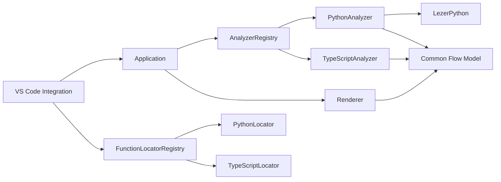
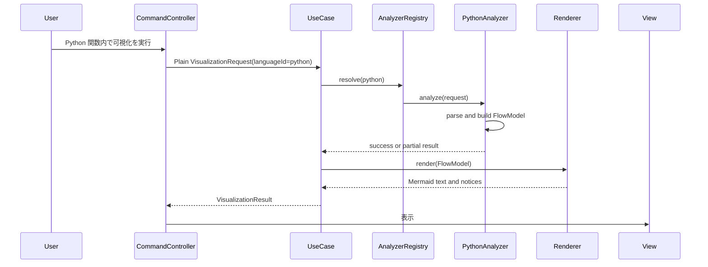

# Design Document

## Overview

Python Function Flow Visualization は、既存の GlitchLens の静的処理フロー可視化を VS Code の `python` languageId に拡張する差分機能である。Python のソースをローカルで構文解析し、カーソルまたは CodeLens で選択した `def`、`async def`、クラスメソッドを Common Flow Model へ変換する。既存の Mermaid Renderer、WebView、コピー、キャッシュ、Workspace Trust は Flow Model を介して再利用する。

### Goals

- Python の関数候補を CodeLens とカーソル位置から特定する。
- Python の構文を Call、Await、Branch、Loop、Try-Catch、Return、Throw、Break、Continue と既存 Flow Model へ変換する。
- 既存 TypeScript / JavaScript Analyzer と独立した Python Analyzer を追加する。
- 実行、Python インタープリタ起動、外部プロセス、外部通信、実行時トレースを行わない。
- 不完全な編集状態または静的に確定できない呼び出しでは、diagnostic 付きの部分結果を優先する。

### Non-Goals

- Python の型推論、import 解決、動的ディスパッチ、`getattr`、`__call__` の完全な解決。
- `match` / `case`、`yield` / `yield from`、ジェネレータ意味論のフロー表現。
- 呼び出し先関数本体への再帰解析。
- 既存 Renderer、WebView、Mermaid 表現、コピー、ズーム UI の Python 専用変更。

## Architecture

### Dependency Direction



- VS Code API は `src/integration/` に閉じ込める。
- `PythonAnalyzer` と `PythonFunctionLocator` は Flow Model contract と `@lezer/python` だけへ依存し、`vscode`、Renderer、WebView、Clipboard へ依存しない。
- Renderer と Application は `FlowModel` のみを入力とし、Python の構文木・パーサー型を扱わない。
- TypeScript Compiler API は従来どおり `analyzers/typescript/` のみに閉じ込める。

### Parser Decision

`@lezer/python` を production dependency として採用する。Lezer は JavaScript の構文木パーサーであり、生成済みの Python grammar package には TypeScript 宣言が含まれる。構文木は `TreeCursor` で走査する。パーサーは文字列から必ず Tree を返すため、編集途中の入力に対しても候補抽出と部分解析を継続できる。

Tree-sitter WASM は高速で堅牢な候補だが、VSIX への grammar WASM 同梱、esbuild でのアセットコピー、実行時のファイル位置解決、ABI 互換性を別途管理する必要がある。また公式資料は Node.js での WASM 実行が native binding より遅いと説明している。本仕様では単一言語の初期対応であり、純粋 JavaScript dependency として bundle できる Lezer の方が配布と保守の境界が小さいため採用する。

- 採用依存: `@lezer/python`（MIT）
- 追加しない依存: Python インタープリタ、`child_process`、native addon、WASM grammar、ネットワーククライアント
- `@lezer/python` の公開 Tree / TreeCursor API のみを利用し、生成済み parser table や内部実装へ依存しない。
- grammar package 更新時にノード名・エラー回復が変化し得るため、Python parser adapter の fixture test を compatibility gate とする。

参考: [Lezer System Guide](https://lezer.codemirror.net/docs/guide/)、[@lezer/python](https://www.npmjs.com/package/@lezer/python)、[Tree-sitter JavaScript/Wasm overview](https://tree-sitter-tree-sitter.mintlify.app/api/javascript/overview)

## Components and Interfaces

### Language-independent function locator

現在の `src/integration/functionRanges.ts` は TypeScript 専用 locator を直接 import している。これを言語非依存の contract と registry に置き換える。

```typescript
export interface FunctionCandidate {
  readonly name: string;
  readonly kind: string;
  readonly range: FunctionRange;
  readonly fullRange: FunctionRange;
  readonly bodyRange?: FunctionRange;
}

export interface FunctionRange extends SourceRange {
  readonly startOffset: number;
  readonly endOffset: number;
}

export interface FunctionLocator {
  readonly id: string;
  readonly version: string;
  readonly languageIds: readonly string[];
  findFunctionCandidates(source: SourceFileInput): readonly FunctionCandidate[];
  findFunctionContainingOffset(source: SourceFileInput, offset: number): FunctionLocatorResult;
  findFunctionByRange(source: SourceFileInput, range: SourceRange): FunctionLocatorResult;
}
```

- `FunctionLocatorRegistry` は `languageId` から locator を選び、未登録時は `unsupported-language` を返す。
- `TypeScriptFunctionLocator` は既存 `analyzers/typescript/functionLocator.ts` の公開実装をこの contract へ移管する。検出対象と range の意味は変更しない。
- `PythonFunctionLocator` は `def`、`async def`、クラス内の同構文を候補として返す。`range` は関数名、`fullRange` は decorator を除く `def` / `async def` から本体末尾、`bodyRange` はインデントされた本体の範囲とする。
- 同じ offset を含む候補が複数あるときは、`fullRange` が最小の候補を返す。これによりネストした関数では内側の関数を選ぶ。
- CodeLens の候補列挙は locator registry を利用し、Analyzer を実行しない。Analyzer は command 実行時に改めて対象を確認する。

### Python parser adapter

`src/analyzers/python/pythonParser.ts` を Lezer の薄い adapter とする。

- adapter 内だけが `@lezer/python` の `parser`、Tree、TreeCursor を import する。
- Lezer の Tree / TreeCursor 型、およびそれらを模倣した公開 node interface は `analyzers/python/` の外へ公開しない。adapter と PythonFunctionLocator / PythonFlowBuilder は同じ言語境界の内部で cursor を直接走査し、構文木全体を独自の immutable node view へ複製しない。
- `LineMap` utility が offset を `SourcePosition` へ変換する。行開始 offset を一度構築し、各 node の `from` / `to` から `SourceLocation` を作成する。
- エラー node を検出した場合は、解析可能な兄弟 node を継続しつつ `unsupported-syntax` または `partial-analysis` diagnostic を追加する。parser の内部エラー文字列はユーザー通知へ露出しない。

### PythonFunctionLocator

`src/analyzers/python/pythonFunctionLocator.ts` は parser adapter を利用して関数候補だけを抽出する。

- decorator は関数候補の名前・本体の解析対象に含めない。
- `async def` は独立の候補として認識し、Analyzer は同じ Flow Model 表現を使う。
- クラス本体を走査して見つかった関数も通常の関数候補と同じように扱う。クラス名や `self` を Flow Model の必須フィールドに追加しない。
- トップレベル、クラス内、nested を問わず `def` と `async def` を CodeLens 候補にする。cursor 位置が複数候補に含まれる場合は、最小の `fullRange` を持つ最内関数を選ぶ。lambda は初期スコープ外であり候補にしない。
- 解析エラーで完全な関数 node を得られない場合は、確定できた候補だけを返す。候補を得られないときは既存の target-not-found フローへ委譲する。

### PythonAnalyzer

`src/analyzers/python/pythonAnalyzer.ts` は `LanguageAnalyzer` を実装する。

```typescript
export class PythonAnalyzer implements LanguageAnalyzer {
  readonly id = 'python';
  readonly version = '1.0.0';
  readonly languageIds = ['python'] as const;
  analyze(input: AnalyzerInput): Promise<AnalyzerResult>;
}
```

処理順序は以下とする。

1. cancellation を確認する。
2. `languageId === 'python'` を検証する。
3. `PythonFunctionLocator` で対象関数を解決する。解決不能なら `invalid-input` を返す。
4. parser adapter の Tree から対象関数 node を取得する。
5. `PythonFlowBuilder` が対象関数の body だけを走査し、FlowModel を生成する。
6. `complete` または `partial` と diagnostic を `AnalyzerResult` として返す。

`PythonFlowBuilder` は TypeScript の `FlowBuilder` と同じ node / edge 不変条件を満たすが、TypeScript AST を共有しない。AST の走査規則と Python の制御構造が異なるため、既存 TypeScript Analyzer の大規模な共通化は行わない。共通化の対象は Flow Model contract とテスト fixture の期待結果に限定する。

### Flow Model language ID

`SupportedLanguageId` は Flow Model の公開 contract として既存4言語の union に固定されている。これを任意の VS Code language ID を保持できる `string` 型へ広げる。型名を保つ場合は `export type SupportedLanguageId = string` とし、Flow Model が Integration の対応言語リストを所有しないようにする。

- `FlowModel.metadata.languageId` と `FlowSource.languageId` は `python` をそのまま保持する。
- 対応可否は Flow Model ではなく `AnalyzerRegistry` と `FunctionLocatorRegistry` が決定する。
- `documentSelector` の `supportedLanguageIds` は runtime の UI 選択子として `python` を加える。

## Python to Flow Model Mapping

| Python construct | Flow Model | Extraction and edges |
|---|---|---|
| `def` / `async def` | `rootFunction` | name と function range を記録する。`async` 自体の node は作らない。 |
| `call()` | `call` | Name は `resolved`。入れ子の call は、子の評価を親の call より先に、静的に推定できる実行順で抽出する。 |
| `object.method()` | `call` | method 名を `calleeName` とする。receiver が静的に単純な Name / Attribute の場合は既存 TS と同じ「命名可能」な `resolved` とする。 |
| `factory().run()` | `call` | `run` は動的 receiver のため `unresolved`、diagnostic を付与する。内側の `factory` call は別 node とする。 |
| `items[index]()` / `getattr(...)()` / 不明な callable | `call` | `calleeName: '<unknown>'`、`unknown` または `unresolved` と diagnostic を付与する。 |
| `await expression` | `await` | 式中の call を評価順で抽出した後に await node を作る。 |
| assignment / annotated assignment | right-hand expression only | Lezer の `AssignStatement` を対象とする。代入先は FlowNode に変換せず、`AssignOp` より後の右辺にある Call / Await を評価順で抽出する。呼び出しがない代入は diagnostic なしで通過する。 |
| augmented assignment | right-hand expression only | Lezer の `UpdateStatement` を対象とする。`UpdateOp` より後の右辺にある Call / Await だけを評価順で抽出し、`retry += 1` のように呼び出しがない更新は diagnostic なしで通過する。右辺の動的 callable は既存の `unknown` / `unresolved` と partial analysis 規則を適用する。 |
| `if` / `elif` / `else` | `branch` | `if` を branch、then を `true`、else / elif を `false` edge とする。`elif` は false 側の入れ子 branch として表現する。表示ラベルには body を含めず条件式だけを保持する。 |
| `for` / `while` | `loop` | loop body を `loop-body`、後続を loop node 起点の `loop-exit` edge で結ぶ。条件・iterable 内の call を body より前に抽出し、表示ラベルには body を含めないヘッダだけを保持する。 |
| `try` / `except` / `finally` | `try-catch` | try / catch / finally edge を使う。`except ... as error` の binding を `catchBinding` に記録する。 |
| `with expr as name` | expression + body | 複数の context expression を左から右の評価順で抽出し、その後に body を処理する。`__enter__` / `__exit__` の暗黙呼び出しは推測しない。 |
| `return expr` | `return` | expr 内の call を return node より前に抽出し、return node を terminal とする。 |
| `raise expr` | `throw` | expr 内の call を throw node より前に抽出し、throw node を terminal とする。 |
| `break` / `continue` | `break` / `continue` | `break` から loop 後の最初の到達可能 node へ `break-exit` edge を、`continue` から loop node へ `continue-loop` edge を作る。通常の `next` edge は作らない。 |

`for ... else`、`while ... else`、`try ... else` は初期スコープで誤った到達可能性を描かないため、該当節を `unsupported-syntax` diagnostic として扱い、前後で解析可能な statement を保持する。`match`、`yield`、`yield from` も同じ partial-analysis 方針とする。

### Assignment and UpdateStatement Extraction

`PythonFlowBuilder` は `AssignStatement` と `UpdateStatement` を control-flow node としては扱わない。各 statement の直接 child から `AssignOp` または `UpdateOp` を識別し、その演算子より後の child だけを `extractCalls` へ渡す。これにより、代入先、型注釈、更新演算子を Call と誤認せず、右辺の `await`、入れ子 call、unknown / unresolved call は既存の式抽出規則で一貫して扱える。

Call / Await を含まない代入・更新は node、edge、diagnostic を追加しない。右辺に call があれば、子式から親式の順で node を追加し、通常 statement と同じ `pendingEdges` / terminal 規則で前後の処理へ接続する。拡張代入そのものは loop、branch、try-catch の edge kind を変更しない。

Loop / Branch の表示ラベルは、対応する `Body` の開始位置より前の header から抽出する。`while retry < 3:` は `retry < 3`、`if saved:` は `saved` とし、本体の statement、改行、インデントはラベルへ含めない。

## Control-flow Construction

`PythonFlowBuilder` は既存の Flow Model 不変条件を維持する。

- `FlowNode.order` は静的に推定できる実行順で 0 から単調増加する。
- `FlowEdge.executionOrder` は追加順に 0 から単調増加する。
- 分岐の mutually exclusive な body 同士を `next` edge で接続しない。
- non-terminal な分岐・try 経路は後続 statement に合流する。
- return / throw / break / continue の後に、同じ到達経路上の `next` edge を追加しない。
- loop は body への `loop-body` と、loop node から通常のループ終了後の後続 statement へ向かう `loop-exit` を持つ。loop body 内の branch、try、catch、finally、または通常 statement を `loop-exit` の source にしない。Break node は `break-exit` で同じ後続へ接続し、Continue node は `continue-loop` で loop node へ接続する。ループの実行回数は Mermaid の sequence diagram で表現しない。
- nested function、lambda、comprehension の callable body は走査しない。ただし対象関数の通常式に含まれる最上位の call は抽出する。

各 statement または一定数の構文 node ごとに cancellation を確認し、50 work item ごとを目安に event loop へ制御を返す。同期的な parser 呼び出しの途中での中断は要求しないが、解析開始前・parse 完了直後・走査中にキャンセルされた場合は `analysis-cancelled` を返し、結果を cache しない。

## Integration and Data Flows

### Command and cursor flow



### CodeLens flow

1. `registerGlitchLensCodeLensProvider` は `supportedLanguageIds` から `python` を含む selector を生成する。
2. Provider は Workspace Trust、cancellation、CodeLens 設定を確認する。
3. `createFunctionCodeLensCommands` は FunctionLocatorRegistry から Python locator を解決し、候補ごとに既存形式の command argument を返す。
4. command 実行後、`CommandController` は既存と同じ plain source request を Application へ渡す。

`vscodeAdapters.ts` の composition root は以下を生成する。

```typescript
const functionLocators = new FunctionLocatorRegistry([
  new TypeScriptFunctionLocator(),
  new PythonFunctionLocator(),
]);

const analyzers = new AnalyzerRegistry([
  new TypeScriptAnalyzer(),
  new PythonAnalyzer(),
]);
```

Provider と command factory には `functionLocators` を dependency injection する。Analyzer registry と locator registry を単一の巨大な registry に統合しない。関数候補列挙は UI の軽量処理、フロー解析は Application の重い処理であり、責務・呼び出し頻度・失敗の扱いが異なるためである。

## Error, Diagnostic, and Cache Policy

| Condition | Analyzer result | User-visible outcome | Cache |
|---|---|---|---|
| Python locator が対象を発見できない | failed / `invalid-input` | target-not-found | 保存しない |
| parser が対象関数内に error node を含むが解析可能 | partial | partial と diagnostic | 保存する |
| 未知・動的な call | partial | unknown / unresolved notice | 保存する |
| 初期スコープ外構文 | partial | unsupported-syntax / partial-analysis notice | 保存する |
| cancellation | failed / `analysis-cancelled` | cancelled | 保存しない |
| parser adapter の予期しない例外 | failed / `analysis-failed` | failed | 保存しない |

既存 `AnalysisCache` は `analyzerId` と `analyzerVersion` を key に含むため、PythonAnalyzer の version を解析規則・parser adapter の意味論が変わるたびに更新する。Python と TypeScript の結果は analyzer ID が異なるため同一 document URI でも混同しない。

## File Structure Plan

```text
src/
├── analyzers/
│   ├── functionLocator.ts                  # language-independent contract
│   ├── functionLocatorRegistry.ts          # languageId → locator
│   ├── typescript/
│   │   └── functionLocator.ts              # contract を実装する既存 locator
│   └── python/
│       ├── pythonParser.ts                 # @lezer/python boundary
│       ├── pythonFunctionLocator.ts        # def / async def candidate discovery
│       └── pythonAnalyzer.ts               # Python AST → FlowModel
├── flow-model/
│   └── sourceLocation.ts                   # language ID union を開放
├── integration/
│   ├── documentSelector.ts                 # python を selector に追加
│   ├── functionRanges.ts                   # locator registry に委譲
│   ├── codeLensCommands.ts                 # locator registry を注入
│   ├── codeLensProvider.ts                 # registry を注入
│   ├── extensionEntry.ts                   # locator-aware provider を登録
│   └── vscodeAdapters.ts                   # Python analyzer / locator の composition
└── test/
    ├── pythonFunctionLocator.test.ts
    ├── pythonAnalyzer.test.ts
    ├── functionLocatorRegistry.test.ts
    ├── codeLensProvider.test.ts
    ├── analyzerContract.test.ts
    └── foundation.test.ts
```

変更対象の manifest と build:

- `package.json`: `@lezer/python` を dependency に追加し、`onLanguage:python` と `glitchlens.supportedLanguages` の `python` を追加する。
- `package-lock.json`: `npm install` によって package metadata を更新する。手編集しない。
- `esbuild.js`: 純粋 JavaScript dependency のため asset copy plugin、native module external、WASM loader を追加しない。`dist/extension.js` への bundle を build test で確認する。

## Test Strategy

### Unit tests

- `PythonFunctionLocator`
  - top-level `def`、`async def`、クラスメソッド、nested `def` の CodeLens 候補、およびカーソルから最内関数の選択
  - name / full / body range、decorator の除外、編集途中の部分候補、対象外 lambda
- `PythonAnalyzer`
  - call の静的な実行順、`outer(inner())` の `inner` → `outer`、await
  - `AssignStatement`、型注釈付き代入、`UpdateStatement` の右辺 Call / Await 抽出、呼び出しを含まない `retry += 1` の無診断通過
  - if / elif / else、for / while、try / except / finally、複数 context expression を持つ with
  - return / raise、break の `break-exit`、continue の `continue-loop`、loop node だけを source とする `loop-exit`
  - `process_orders` fixture: nested for / while、try / except、await、複数分岐、`if saved: break`、`retry += 1` に対し、`validate_order`、`charge`、`notify`、`save`、`append`、`error` の抽出、`catchBinding: error`、warning のない Mermaid を検証する
  - Loop / Branch label が `for order in orders`、`retry < 3`、`saved` のように body を含まないことを検証する
  - unknown / unresolved call、構文エラー、スコープ外構文、partial result
  - cancellation の開始前・走査中、および FlowModel の plain-data 性
- `FunctionLocatorRegistry` と `AnalyzerRegistry`
  - `python` を正しい実装へ解決し、未登録言語を拒否する。
- parser compatibility fixture
  - Python source fixture ごとに adapter が必要な関数・制御構造を認識することを検証する。Lezer node 名を Analyzer 全体へ散在させない。

### Regression tests

- 現行 TypeScript / JavaScript / TSX / JSX の locator、CodeLens、Analyzer、Renderer の全既存 test を保持する。
- 共通契約の追従作業では、TypeScript / JavaScript の入れ子 call を実行順へ更新する test を追加し、既存の構文走査順を期待する test を置き換える。この仕様段階では実装・test 変更は行わない。
- `foundation.test.ts` は manifest activation events と `supportedLanguageIds` に `python` が揃うことを検証し、Python が未対応である前提の assertion を削除・置換する。
- `codeLensProvider.test.ts` は Python selector と Python function range を追加し、既存言語の期待候補が変わらないことを確認する。
- analyzer boundary test は `@lezer/python` import が `analyzers/python/` だけに限定されること、`child_process`、`vm`、`fetch`、trace API が production source に入らないことを検証する。

### Validation commands

```bash
npm run check-types
npm run lint
npm run test:unit
npm run compile
npm run test:integration
npm run package
```

`npm run package` の成功は、Lezer dependency が esbuild の production bundle に含まれ、VSIX 側で追加の runtime asset を必要としないことの確認に用いる。実装時は `dist/extension.js` に native binary、WASM asset、外部 URL が含まれないことも安全性テストで確認する。

## Requirements Traceability

| Requirement | Design response |
|---|---|
| 1: Python 関数の対象特定 | `PythonFunctionLocator` と `FunctionLocatorRegistry` を導入し、nested `def` を含む CodeLens と cursor の両方を同一候補 contract で扱う。 |
| 2: 静的処理フロー抽出 | `PythonAnalyzer` / `PythonFlowBuilder` が Python 構文を共通の実行順・loop control edge contract へ変換する。`AssignStatement` / `UpdateStatement` は右辺の Call / Await のみを抽出する。 |
| 3: Common Flow Model 境界 | parser adapter を `analyzers/python/` に閉じ、Flow Model language ID と Renderer / FlowEdge の共通契約変更は共通仕様で定義する。 |
| 4: 未解決呼び出しと部分結果 | call resolution 規則、error node の diagnostic、partial result と既存 notification path を定義する。 |
| 5: 安全性・応答性・互換性 | Lezer の in-process parse、cancellation cooperation、cache version、native/WASM/外部プロセスを排除した配布、非退行テストで保証する。 |

## Revalidation Triggers

- Python の `match`、generator、comprehension、import / type 解決をスコープへ加える場合。
- Flow Model に context manager 専用または Python 専用 node kind を追加する場合。
- `@lezer/python` の major update、ノード構造の変更、または parser adapter fixture が失敗する場合。
- Python 以外の追加言語が locator registry と parser dependency の選択へ影響する場合。
- package / esbuild が JavaScript bundle 以外の asset または native binary を要求する場合。

## Requirement 6 Design Update: Python ライフライン主体名

### Boundary Commitments

**This Spec Owns**

- Python 構文から、共通 `FlowParticipant` に渡すインスタンス、クラス、役割、および module fallback 候補を抽出すること。
- Python の Call と root function が共通 Requirement 16 の participant priority と Unknown / Unresolved 規則に従うこと。
- Python 固有の participant extraction に対する fixture と回帰検証。

**Out of Boundary**

- Python の型推論、import の完全解決、実行時 object / descriptor / `__call__` の同定。
- Python 専用の Mermaid syntax、WebView 表示処理、Clipboard 経路、または SourceMap 形式。

**Allowed Dependencies**

- `@lezer/python` の Name、MemberExpression、class declaration、source range。
- 共通 `FlowParticipant` contract、SourceLocation URI、MermaidRenderer。

**Revalidation Triggers**

- Python parser の node 名または class / member expression の構造が変わる場合。
- 共通 participant priority、label format、key の意味、Unknown / Unresolved の表示を変える場合。
- Python source URI から module name を導出する規則を変更する場合。

### Architecture Decision

`PythonFlowBuilder` は `calleeName` を操作名として保持しつつ、MemberExpression の左側 Name を instance / role 候補として `FlowParticipant` に変換する。クラス内の root function は enclosing class 名を優先し、top-level function と主体候補のない Call は source URI から導く `: <module>` を使用する。動的な `factory().run()`、index access、`getattr`、または source URI も得られない Call は、既存 resolution に従って `: Unresolved` または `: Unknown` を使う。

この処理は parser adapter と Analyzer の内側に閉じ、Lezer node や Python 固有型を Common Flow Model、Renderer、WebView へ渡さない。共通 Renderer が participant key で集約するため、Python は言語専用の表示ロジックを持たない。

### Python Participant Extraction Contract

| Python source form | Participant candidate | Operation message | Fallback |
|---|---|---|---|
| `service.save()` | `service` instance / role | `save` | source module |
| `ClassName.build()` | `ClassName` class | `build` | source module |
| class method `def run` | enclosing class | operation names in body | source module |
| `foo()` | source module | `foo` | Unknown when source is unavailable |
| `factory().run()` | no reliable candidate | `run` | Unresolved |
| `items[index]()` / `getattr(...)()` | no reliable candidate | existing safe operation name or unknown call | Unknown / Unresolved |

### File Structure Impact

- `src/analyzers/python/pythonAnalyzer.ts` — source form と enclosing class を読み、Call / root に共通 participant candidate を設定する。
- `src/flow-model/flowParticipant.ts`、`src/flow-model/flowModel.ts`、`src/flow-model/flowNode.ts` — 共通仕様が定める participant data を利用する。
- `src/test/pythonFunctionFlow.test.ts` — instance、class、module、Unknown / Unresolved の優先順位と操作名を検証する。
- `src/test/mermaidRenderer.test.ts`、`src/test/visualizationView.test.ts` — Python Flow Model でも共通 participant title、Mermaid copy、SourceMap が一致することを検証する。

### Requirements Traceability Amendment

| Requirement | Design response |
|---|---|
| 6.1 | Python Name / MemberExpression と enclosing class から共通 FlowParticipant を生成する。 |
| 6.2 | SourceLocation URI から `: <module>` を導出する。 |
| 6.3 | dynamic call は共通 key の Unknown / Unresolved へ集約する。 |
| 6.4 | `calleeName` を引数なしの操作 message として維持する。 |
| 6.5 | Python 専用 Renderer / WebView 分岐を追加せず、共通 Renderer contract を使用する。 |

### Testing Strategy Amendment

- `pythonFunctionFlow.test.ts` で `service.save()`、class method、top-level `foo()`、`factory().run()`、computed / `getattr` を解析し、participant kind / label と operation name を確認する。
- 共通 Renderer fixture で、Python の同一 participant が集約され、異なる participant の同名 operation が分離され、Unknown / Unresolved が各一つであることを確認する。
- 既存の `process_orders` fixture を participant contract 付きで再検証し、実行順、diagnostic、SourceMap、Mermaid text のコピーが維持されることを確認する。
